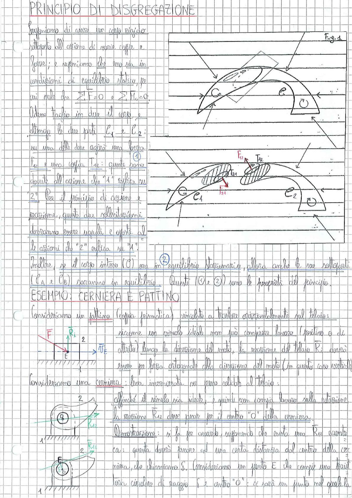

# Page 53 - Principio di Disgregazione

## PRINCIPIO DI DISGREGAZIONE

Supponiamo di avere un corpo rigido sottoposto all'azione di varie coppie e forze; e supponiamo che esso sia in condizioni di equilibrio statico, per cui vale che:

$$\sum \vec{F} = 0 \quad \sum \vec{M}_o = 0$$

Adesso taglio in due il corpo, e ottengo le due parti $C_1$ e $C_2$:

> 
> Diagramma: Corpo rigido C tagliato in due parti C₁ e C₂, con indicazione delle forze e coppie di interazione interne F₁₂, T₁₂, F₂₁, T₂₁ sulla superficie di taglio (Fig. 3.1)

**①** Su una delle due agirà una forza $F_{12}$ e una coppia $T_{12}$: queste sono dovute all'azione che "1" esplica su "2". Per il principio di azione e reazione, queste due sollecitazioni dovranno essere uguali e opposte alle azioni che "2" esplica su "1".

**②** Inoltre, se il corpo intero (C) era in equilibrio stazionario, allora anche le sue sottoparti ($C_A$ e $C_B$) saranno in equilibrio. Queste (①e ②) sono le proprietà del principio.

## ESEMPIO: CERNIERA E PATTINO

Consideriamo un pattino (coppia prismatica) vincolato a traslare orizzontalmente sul telaio:

> 
> Diagramma: Schema di pattino con forza F applicata verticalmente, reazione R₁ verticale, e velocità vₑ orizzontale nel punto E

Siccome un vincolo ideale non può compiere lavoro (positivo o di attrito) lungo la direzione del moto, la reazione del telaio $R_1$ dovrà essere per forza ortogonale alla direzione del moto (in questo caso verticale).

Consideriamo una cerniera: essa è incernierata su perno solidale al telaio:

> 
> Diagramma: Schema di cerniera con centro O, reazione R₁₂ passante per il centro, e secondo schema con punto E su circonferenza di raggio S e centro O

Affinché il vincolo sia ideale, e quindi non compia lavoro sulla rotazione, la reazione $R_{12}$ deve passare per il centro "O" della cerniera.

**Dimostrazione:** si fa per assurdo, supponendo che esista una $R_{12}$ eccentrica: questa dovrà tangere ad una certa distanza dal centro della cerniera, che chiamiamo $S$. Consideriamo un punto E che compie una traiettoria circolare di raggio $S$ e centro "O": ci sarà un punto nel quale
