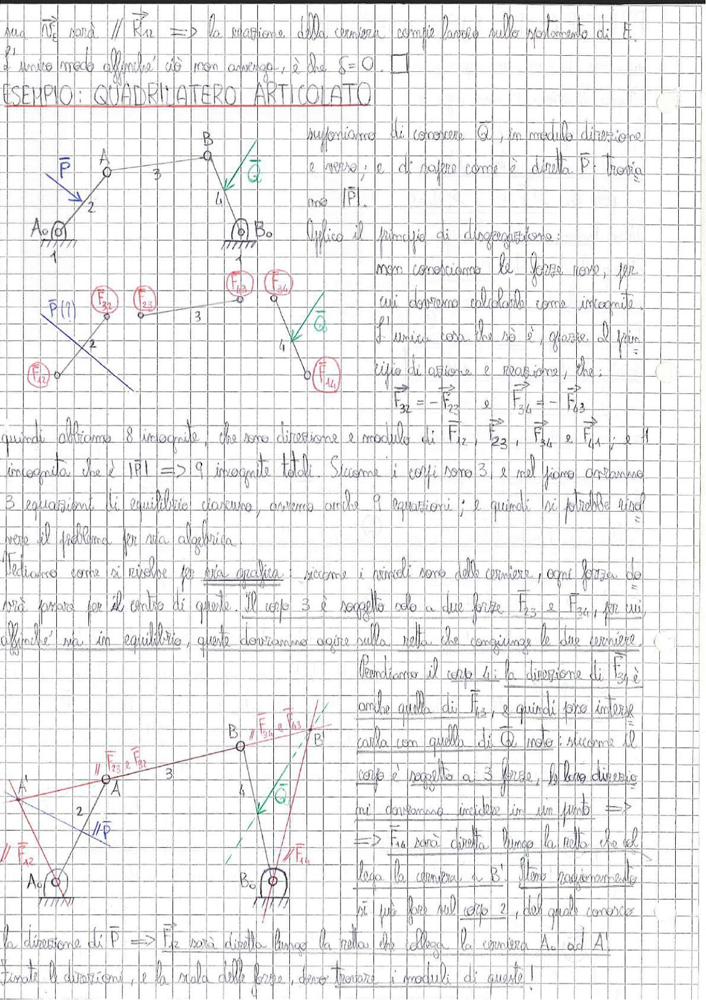

# Page 54 - Esempio: Quadrilatero Articolato

sia $\vec{F_2}$ sarà $// \vec{R}_{12}$ $\Rightarrow$ la reazione della cerniera compie lavoro nullo spostamento di $\vec{F}$, e nello modo affinché ciò non avvenga, è che $\mathscr{L} = 0$. $\square$

## ESEMPIO: QUADRILATERO ARTICOLATO

> 
> Diagramma: Quadrilatero articolato con cerniere a terra in $A_0$ e $B_0$, manovella 2, biella 3 e bilanciere 4. Forza $\vec{P}$ applicata al membro 2 e coppia $\vec{Q}$ applicata al membro 4.

Supponiamo di conoscere $\vec{Q}$, in modulo direzione e verso; e di sapere come è diretta $\vec{P}$: trovare $|\vec{P}|$.

Applico il principio di disgregazione:

non conosciamo le forze rosa, per cui dovremo calcolarle come incognite. L'unica cosa che so è, grazie al principio di azione e reazione, che:

$$\vec{F}_{32} = -\vec{F}_{23} \quad e \quad \vec{F}_{34} = -\vec{F}_{43}$$

> 
> Diagramma: Schema del quadrilatero disgregato nei singoli membri con le forze interne $\vec{F}_{12}$, $\vec{F}_{32}$, $\vec{F}_{23}$, $\vec{F}_{43}$, $\vec{F}_{34}$, $\vec{F}_{14}$ indicate sulle cerniere, la forza $\vec{P}$ sul membro 2 e la coppia $\vec{Q}$ sul membro 4.

Quindi abbiamo 8 incognite, che sono direzione e modulo di $\vec{F}_{12}$, $\vec{F}_{23}$, $\vec{F}_{34}$ e $\vec{F}_{14}$; e 1 incognita che è $|\vec{P}|$ $\Rightarrow$ 9 incognite totali. Siccome i corpi sono 3, e nel piano abbiamo 3 equazioni di equilibrio ciascuno, avremo anche 9 equazioni; e quindi si potrebbe risolvere il problema per via algebrica.

Vediamo come si risolve per via grafica: siccome i vincoli sono delle cerniere, ogni forza dovrà passare per il centro di queste. Il corpo 3 è soggetto solo a due forze $\vec{F}_{23}$ e $\vec{F}_{34}$, per cui, affinché sia in equilibrio, queste dovranno agire sulla retta che congiunge le due cerniere.

Prendiamo il corpo 4: la direzione di $\vec{F}_{34}$ è anche quella di $\vec{F}_{43}$, e quindi fare intersecare con quella di $\vec{Q}$ nota; siccome il corpo è soggetto a 3 forze, le loro direzioni dovranno incidere in un punto $\Rightarrow$

$$\Rightarrow \vec{F}_{14} \text{ sarà diretta lungo la retta che collega la cerniera a } B'$$

Stesso ragionamento si può fare sul corpo 2, del quale conosciamo la direzione di $\vec{P}$ $\Rightarrow$ $\vec{F}_{12}$ sarà diretta lungo la retta che collega la cerniera $A_0$ ad $A'$.

> 
> Diagramma: Costruzione grafica per la risoluzione dell'equilibrio del quadrilatero articolato, con le direzioni delle forze che convergono nei punti $A'$ e $B'$, e le cerniere a terra $A_0$ e $B_0$.

Trovate le direzioni, e la scala delle forze, devo trovare i moduli di queste!
