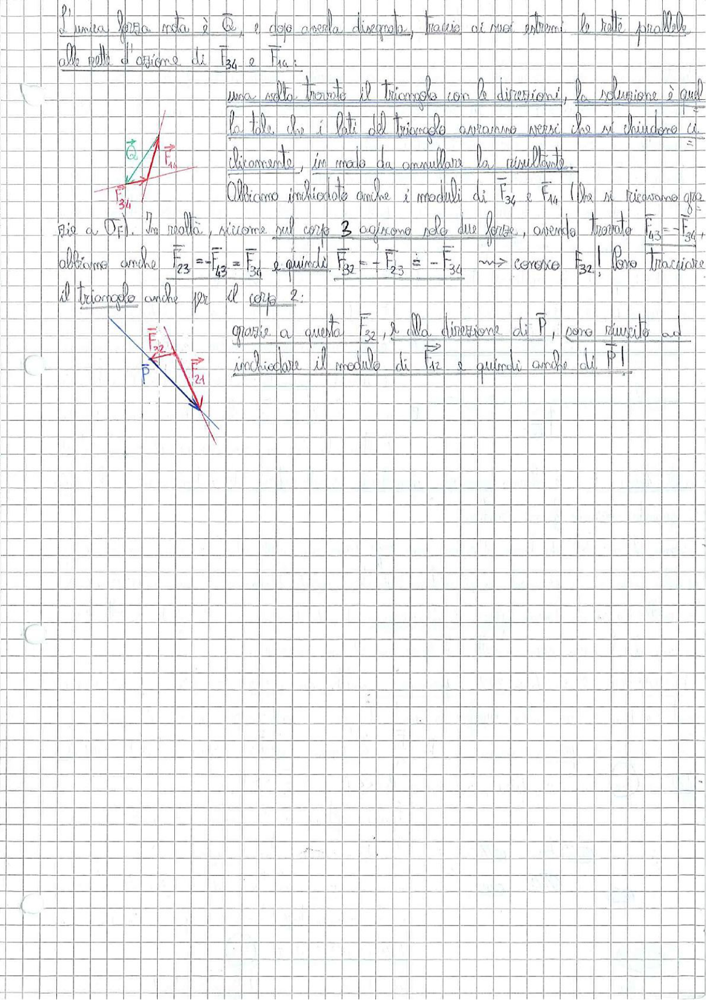

# Page 55 - Equilibrio statico: risoluzione grafica delle forze (continuazione)

L'unica forza nota è $\vec{Q}$, e dopo averla disegnata, traccio di suoi estremi le rette parallele alle rette d'azione di $\vec{F}_{34}$ e $\vec{F}_{14}$:

> 
> Diagramma: Triangolo delle forze per il corpo 4, con vettori $\vec{Q}$, $\vec{F}_{14}$ e $\vec{F}_{34}$ rappresentati in verde e rosso, che si chiudono formando un triangolo

Una volta trovato il triangolo con le direzioni, la soluzione è quel la tale che i lati del triangolo avranno versi che si chiudono ciclicamente, in modo da annullare la risultante.

Abbiamo individuato anche i moduli di $\vec{F}_{34}$ e $\vec{F}_{14}$ (che si ricavano graficamente grazie a $\vec{Q}$). In realtà, siccome sul corpo **3** agiscono solo due forze, avendo trovato $\vec{F}_{43} = -\vec{F}_{34}$, otteniamo anche $\vec{F}_{23} = -\vec{F}_{43} = \vec{F}_{34}$ e quindi $\vec{F}_{32} = -\vec{F}_{23} = -\vec{F}_{34}$ $\longrightarrow$ conosco $\vec{F}_{32}$! Posso tracciare il triangolo anche per il corpo 2:

> 
> Diagramma: Triangolo delle forze per il corpo 2, con vettori $\vec{F}_{32}$, $\vec{F}_{12}$ e $\vec{P}$ rappresentati in rosso e blu, che si chiudono in un poligono

Grazie a questa $\vec{F}_{32}$, e alla direzione di $\vec{P}$, sono riuscito ad individuare il modulo di $\vec{F}_{12}$ e quindi anche di $\vec{P}$!
