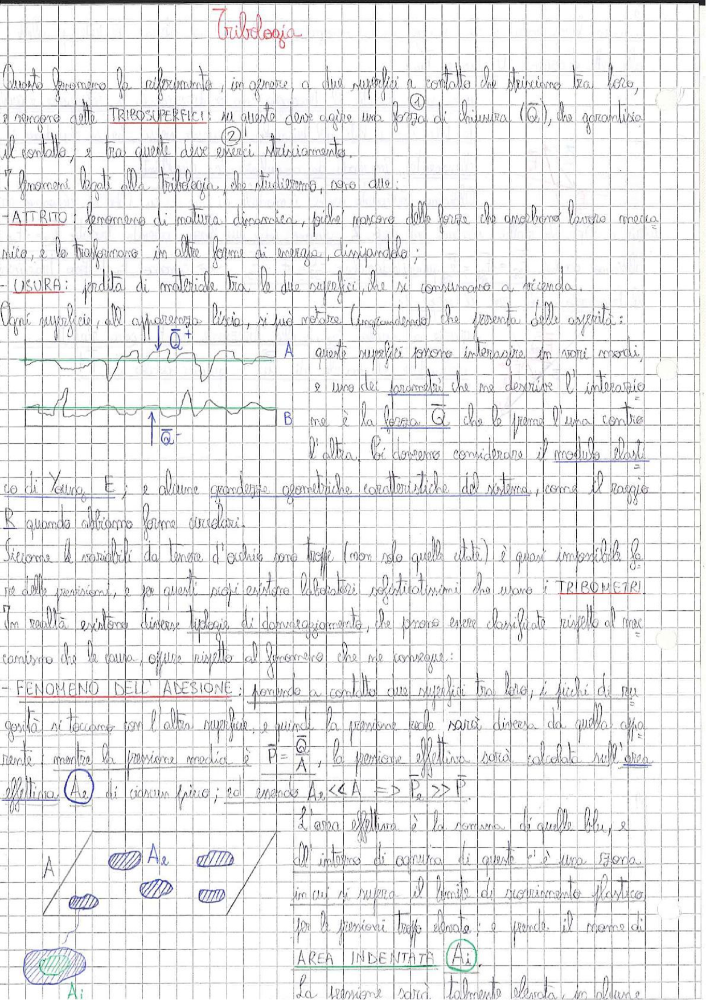

# Page 56 - Tribologia

Questo fenomeno fa riferimento, in genere, a due superfici a contatto che strisciano tra loro, e vengono dette **TRIBOSUPERFICI**: su queste deve agire una forza di chiusura ($\vec{Q}$), che garantisca il contatto, e tra queste deve esserci strisciamento.

I fenomeni legati alla Tribologia, che studieremo, sono due:

- **ATTRITO**: fenomeno di natura dinamica, perché nascono delle forze che assorbono lavoro meccanico, e lo trasformano in altre forme di energia, dissipandolo;

- **USURA**: perdita di materiale tra le due superfici, che si consumano a vicenda.

Ogni superficie, all'apparenza liscia, si può notare (ingrandendo) che presenta delle asperità:

> 
> Diagramma: Due superfici A e B a contatto con asperità, con forza di chiusura $\vec{Q}^+$ applicata sulla superficie A (verso il basso) e $\vec{Q}^-$ sulla superficie B (verso l'alto). Le superfici presentano rugosità microscopica.

A queste superfici possiamo interessarci in vari modi, e uno dei parametri che ne descrive l'interazione ma è la forza $\vec{Q}$ che le preme l'una contro l'altra. Ci dobbiamo considerare il modulo elastico di Young $E$; e alcune grandezze geometriche caratteristiche del sistema, come il raggio $R$ quando abbiamo forma circolari.

Siccome le variabili da tenere d'occhio sono troppe (non solo quelle citate) è quasi impossibile fare delle previsioni, e per questo scopi esistono laboratori sostitutivi/strumenti che usano i **TRIBOMETRI**.

In realtà esistono diverse tipologie di danneggiamento, che possono essere classificate rispetto al meccanismo che le causa, oppure rispetto al fenomeno che ne consegue:

## - FENOMENO DELL'ADESIONE

Ponendo a contatto due superfici tra loro, i picchi di una posta si toccano con l'altra superficie, e quindi la pressione reale sarà diversa da quella apparente; mentre la pressione media è:

$$P = \frac{\vec{Q}}{A}$$

la pressione effettiva sarà calcolata sull'area effettiva $A_e$ di ciascun picco; ed essendo $A_e \ll A \Rightarrow P_e \gg P$.

L'area effettiva è la somma di quelle blu, e all'interno di ognuna di queste c'è una zona in cui si supera il limite di scorrimento plastico per le pressioni troppo elevate; e prende il nome di:

$$\boxed{\text{AREA INDENTATA } (A_i)}$$

> 
> Diagramma: Rappresentazione schematica delle aree di contatto. A sinistra l'area totale $A$ con le zone di contatto effettivo (ellissi blu) che formano l'area $A_e$. In basso, all'interno di ciascuna area effettiva, si trova l'area indentata $A_i$ (zona di deformazione plastica).

La pressione sarà talmente elevata da ottenere
