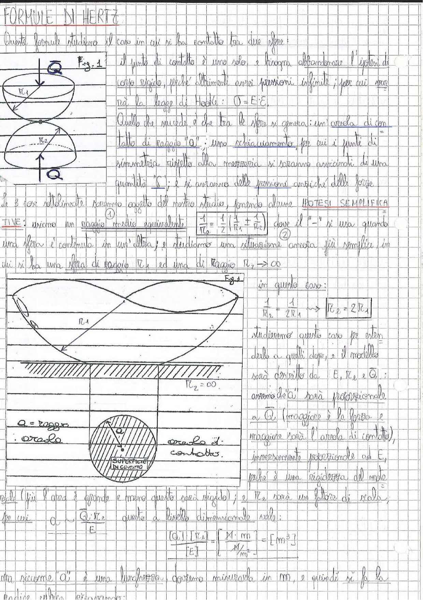

# Page 58 - Formule di Hertz

## FORMULE DI HERTZ

Queste formule studiano il caso in cui si ha contatto tra due sfere:

> 
> Diagramma: Due sfere di raggio $R_1$ e $R_2$ a contatto, con forza $\vec{Q}$ applicata verticalmente

Il punto di contatto è uno solo, e bisogna abbandonare l'ipotesi di corpo rigido, perché altrimenti avrei pressioni infinite; per cui non varrà la legge di Hooke: $\sigma = E \cdot \varepsilon$.

Quello che succede è che tra le sfere si genera un'areola di contatto di raggio "$a$"; uno schiarimento, per cui i punti di simmetria rispetto alla mezzeria si saranno avvicinati di una quantità "$\delta$"; e si avranno delle pressioni erotiche delle forze.

Le $\delta$ così determinate saranno oggetto del nostro studio, facendo alcune **IPOTESI SEMPLIFICATIVE**:

**①** usiamo un raggio medio equivalente:

$$\boxed{\frac{1}{R_e} = \frac{1}{2}\left(\frac{1}{R_1} \pm \frac{1}{R_2}\right)}$$

dove il "$-$" si usa quando una sfera è contenuta in un'altra; **②** e studiamo una situazione ancora più semplice, in cui si ha una sfera di raggio $R_1$ ed una di raggio $R_2 \to \infty$.

> 
> Diagramma: Sfera di raggio $R_1$ a contatto con un piano ($R_2 = \infty$), con dettaglio dell'areola di contatto circolare di raggio $a$ e della superficie di contatto

In questo caso:

$$\frac{1}{R_e} = \frac{1}{2R_1} \implies \boxed{R_e = 2R_1}$$

Studieremo questo caso per estenderlo a quali dopo, e il modello sarà descritto da $E$, $R_e$ e $\vec{Q}$: avremo che "$a$" sarà proporzionale a $\vec{Q}$ (maggiore è la forza e maggiore sarà l'areola di contatto), inversamente proporzionale ad $E$, poiché è una rigidezza del materiale (più l'area è grande e meno questo sarà rigido); e $R_e$ sarà un fattore di scala, per cui:

$$a \sim \frac{Q \cdot R_e}{E}$$

Queste a livello dimensionale vale:

$$\frac{[Q] \cdot [R_e]}{[E]} = \frac{N \cdot m}{N/m^2} = [m^3]$$

Ma siccome "$a$" è una lunghezza, dovremo misurarla in $m$, e quindi si fa la radice cubica:
