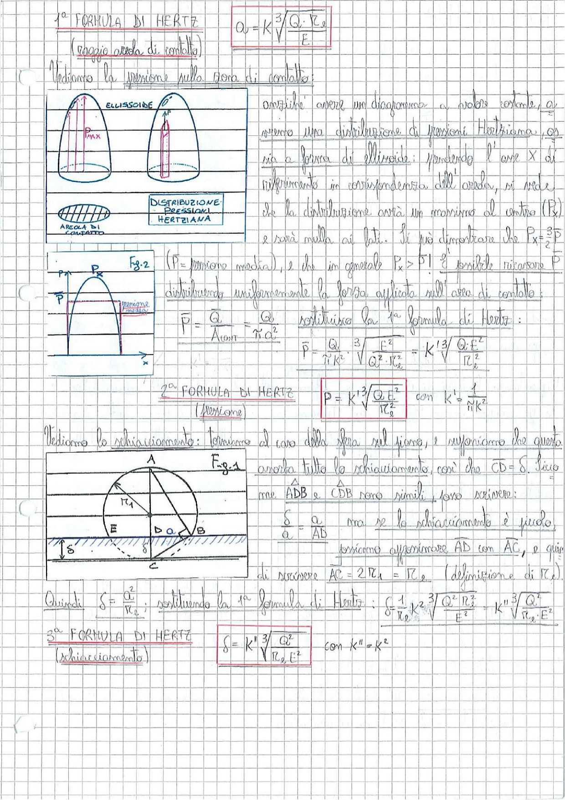

# Page 59 - Formule di Hertz (Pressione e Schiacciamento)

## 1ª Formula di Hertz (raggio areola di contatto)

$$\boxed{a = K \sqrt[3]{\frac{Q \cdot r_0}{E}}}$$

## Pressione sulla zona di contatto

Vediamo la pressione sulla zona di contatto:

> 
> Diagramma: Distribuzione delle pressioni hertziane sull'areola di contatto. Vista frontale dell'ellissoide di pressione con $P_{max}$ al centro e vista laterale. Sotto: areola di contatto con tratteggio.

Potremmo avere un diagramma a quota costante, e avremo una distribuzione di pressioni Hertziana, non a forma di ellissoide: prendendo l'asse X di riferimento in corrispondenza dell'areola, si vede che la distribuzione avrà un massimo al centro ($P_x$) e sarà nulla ai lati. Si può dimostrare che $P_x = \frac{3}{2}P$.

> 
> Diagramma: Fig. 2 - Distribuzione di pressione con $P_x$ al centro e $P$ (pressione media) indicata. Profilo parabolico della distribuzione.

($P$ = pressione media), e che in generale $P_x > P$! È possibile ricavare $P$ distribuendo uniformemente la forza applicata sull'area di contatto:

$$\bar{P} = \frac{Q}{A_{cont}} = \frac{Q}{\pi a^2}$$

sostituisco la 1ª formula di Hertz:

$$\bar{P} = \frac{Q}{\pi K^3} \sqrt[3]{\frac{E^2}{Q^2 \cdot r_0^2}} = K' \sqrt[3]{\frac{Q \cdot E^2}{r_0^2}}$$

## 2ª Formula di Hertz (Pressione)

$$\boxed{P = K' \sqrt[3]{\frac{Q \cdot E^2}{r_0^2}}} \quad \text{con} \quad K' = \frac{1}{\pi K^2}$$

## Schiacciamento

Vediamo lo schiacciamento: torniamo al caso della sfera sul piano, e supponiamo che questa assorba tutto lo schiacciamento, con che $CD = \delta$. Siccome $A\hat{D}B$ e $C\hat{D}B$ sono simili, posso scrivere:

> 
> Diagramma: Fig. 1 - Sfera di raggio $r_1$ appoggiata su un piano. Punti A, B sulla superficie di contatto, E sul piano, D e C sull'asse verticale. Lo schiacciamento $\delta$ è indicato come distanza verticale.

$$\frac{\delta}{a} = \frac{a}{AB}$$

ma se lo schiacciamento è piccolo, possiamo approssimare $AD$ con $AC$, e quindi di scrivere $AC = 2r_1 = r_0$ (definizione di $r_0$).

Quindi $\delta = \frac{a^2}{r_0}$; sostituendo la 1ª formula di Hertz:

$$\delta = \frac{1}{r_0} K^2 \sqrt[3]{\frac{Q^2 \cdot r_0^2}{E^2}} = K'' \sqrt[3]{\frac{Q^2}{r_0 \cdot E^2}}$$

## 3ª Formula di Hertz (Schiacciamento)

$$\boxed{\delta = K'' \sqrt[3]{\frac{Q^2}{r_0 \cdot E^2}}} \quad \text{con} \quad K'' = K^2$$
