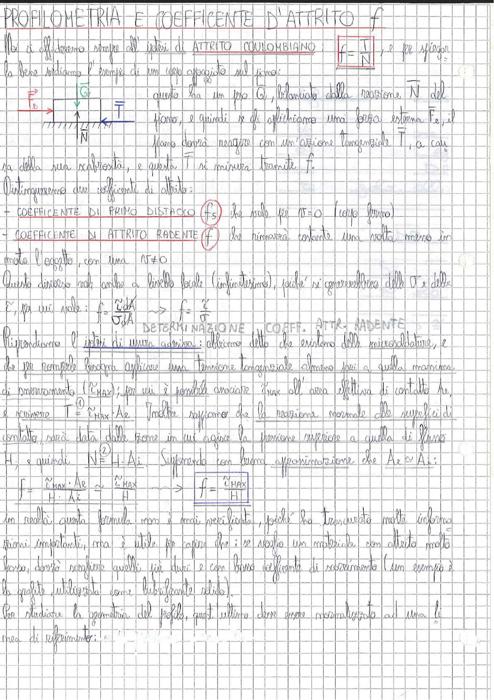

# Page 60 - Profilometria e Coefficiente d'Attrito

## PROFILOMETRIA E COEFFICENTE D'ATTRITO $f$

Noi ci affideremo sempre all'ipotesi di **ATTRITO COULOMBIANO**, e per spiegare

$$\boxed{f = \frac{T}{N}}$$

la bene vediamo l'esempio di un corpo appoggiato sul piano:

> 
> Diagramma: corpo appoggiato su un piano con forza peso $\vec{G}$ verso il basso, reazione normale $\vec{N}$ verso l'alto, forza esterna $\vec{F}_e$ applicata orizzontalmente e forza tangenziale d'attrito $\vec{T}$ opposta al moto

Questo ha un peso $\vec{G}$, bilanciato dalla reazione $\vec{N}$ del piano, e quindi se gli applichiamo una forza esterna $\vec{F}_e$, il piano dovrà reagire con un'azione tangenziale $T$, a causa della sua scabrosità, e questa $T$ si misura tramite $f$.

Distingueremo due coefficenti di attrito:

- **COEFFICENTE DI PRIMO DISTACCO** $\left(f_s\right)$ che vale per $v = 0$ (corpo fermo)
- **COEFFICENTE DI ATTRITO RADENTE** $\left(f\right)$ che rimarrà costante una volta messo in moto l'oggetto, con una $v \neq 0$

Questo discorso vale anche a livello locale (infinitesimo), poiché si generalizzano delle $T$ e delle $\vec{F}$, per cui vale:

$$f = \frac{\tilde{\tau} \, dA}{\tilde{\sigma} \, dA} \quad \Rightarrow \quad f = \frac{\tilde{\tau}}{\tilde{\sigma}}$$

## DETERMINAZIONE COEFF. ATTR. RADENTE

Riprendiamo l'ipotesi di usura adesiva: abbiamo detto che esistono delle microsaldature, e che per romperle bisogna applicare una tensione tangenziale almeno pari a quella massima di snervamento ($\tilde{\tau}_{MAX}$); per cui è possibile associare $\tilde{\tau}_{MAX}$ all'area effettiva di contatto $A_e$, e scrivere:

$$T = \tilde{\tau}_{MAX} \cdot A_e \quad \text{①}$$

Inoltre sappiamo che la reazione normale alle superfici di contatto sarà data dalle zone in cui agisce la tensione superiore a quella di flusso $H$, e quindi:

$$N = H \cdot A_i \quad \text{②}$$

Supponendo con buona approssimazione che $A_e \approx A_i$:

$$f = \frac{\tilde{\tau}_{MAX} \cdot A_e}{H \cdot A_i} \approx \frac{\tilde{\tau}_{MAX}}{H} \quad \Rightarrow \quad \boxed{f = \frac{\tilde{\tau}_{MAX}}{H}}$$

In realtà questa formula non è mai precissima, poiché ha trascurato molte informazioni importanti, ma è utile per capire che: se voglio un materiale con attrito molto basso, dovrò scegliere quelli più duri e con basso coefficiente di scorrimento (un esempio è la grafite, utilizzata come lubrificante solido).

Per studiare la geometria del profilo, quest'ultimo deve essere normalizzato ad una linea di riferimento:
