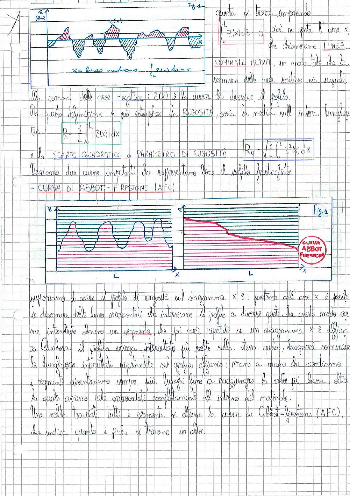

# Page 61 - Rugosità e Curva di Abbott-Firestone

> 
> Diagramma: Profilo di rugosità z(x) con linea mediana e aree positive/negative evidenziate

Questa si trova imponendo

$$\int_0^L z(x) \, dz = 0$$

cioè si posta l'asse $x$, che chiameremo **LINEA NOMINALE MEDIA**, in modo tale che la somma delle aree positive sia uguale alla somma delle aree negative; $z(x)$ è la curva che descrive il profilo.

$x$ = linea mediana, $\int_0^L z(x) \, dx = 0$

Da questa definizione si può estrapolare la **RUGOSITÀ**, ossia la media sull'intera lunghezza.

$$\boxed{R_a = \frac{1}{L} \int_0^L |z(x)| \, dx}$$

e lo **SCARTO QUADRATICO** o **PARAMETRO DI RUGOSITÀ**:

$$\boxed{R_q = \sqrt{\frac{1}{L} \int_0^L z^2(x) \, dx}}$$

Vediamo due curve importanti che rappresentano bene il profilo frastagliato:

## - CURVA DI ABBOTT-FIRESTONE (AFC)

> 
> Diagramma: A sinistra, profilo di rugosità con linee orizzontali a diverse quote che intersecano il profilo (Fig. 1). A destra, la curva di Abbott-Firestone risultante, ottenuta riportando le lunghezze intercettate su un diagramma x-z affiancato.

Supponiamo di avere il profilo di rugosità sul diagramma x-z: partendo dall'asse $x$ è possibile disegnare delle linee orizzontali che intersecano il profilo a diverse quote. In questo modo per me intercetterà almeno un segmento, che poi sarà riportato su un diagramma x-z affiancato. Qualora il profilo venga intercettato più volte sulla stessa quota, bisognerà sommare le lunghezze intercettate riportandole sul grafico affianco: mano a mano che scendiamo i segmenti diventeranno sempre più lunghi fino a raggiungere la valle più bassa, oltre la quale avremo nelle orizzontali completamente all'interno del materiale.

Una volta tracciati tutti i segmenti si ottiene la curva di Abbott-Firestone (AFC), che indica quanto i picchi si trovano in alto.
