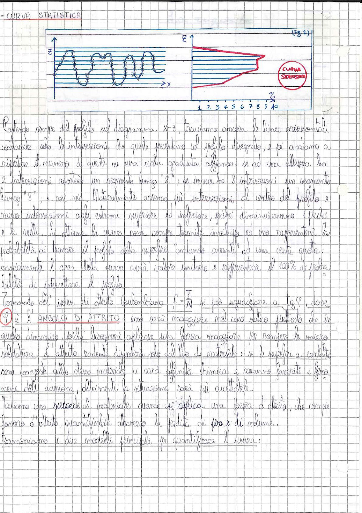

# Page 62 - Curva Statistica e Angolo di Attrito

## Curva Statistica

> 
> Diagramma: A sinistra, profilo di una superficie con asperità (picchi e valli) nel piano X-Z con linee orizzontali di intersezione. A destra (Fig. 2), curva statistica risultante che mostra la percentuale di intersezioni in funzione della quota Z, con asse orizzontale in % (da 1 a 10).

Partendo sempre dal profilo nel diagramma X-Z, tracciamo ancora le linee orizzontali contando solo le intersezioni che queste presentano col profilo disegnato; e poi andiamo a riportare il numero di queste su una scala graduata affianco: se ad una altezza ho 2 intersezioni riporterò un segmento lungo "2"; se invece ho 8 intersezioni un segmento lungo "8"; e così via. Naturalmente avremo più intersezioni al centro del profilo e meno intersezioni agli estremi superiore ed inferiore, poiché diminuiranno i picchi e le valli. Si ottiene la curva non sempre tramite inviluppo ed essa rappresenterà la probabilità di trovare il profilo della superficie "andando avanti" ad una certa quota; ovviamente l'area della curva sarà valore unitario e rappresenterà il 100% di probabilità di intercettare il profilo.

## Angolo di Attrito

Tornando all'ipotesi di attrito Coulombiano $f = \dfrac{T}{N}$ si può uguagliare a $\tan\varphi$, dove

$\boxed{\varphi \text{ è l'ANGOLO DI ATTRITO}}$

esso sarà maggiore nel caso statico piuttosto che in quello dinamico, poiché bisognerà applicare una forza maggiore per rompere le micro saldature. L'attrito radente dipenderà solo dal tipo di materiale: se le superfici a contatto sono composte dallo stesso materiale ci sarà affinità chimica e saranno favoriti i fenomeni di adesione. Altrimenti la situazione sarà più accettabile.

## Usura da Attrito

Vediamo cosa succede al materiale quando si applica una forza d'attrito, che compie lavoro d'attrito, quantificabile attraverso la perdita di peso e di volume.

Esaminiamo i due modelli principali per quantificare l'usura:
