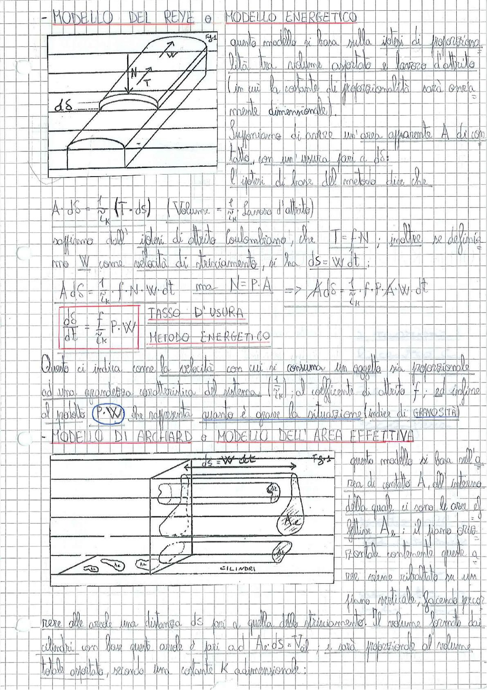

# Page 63 - Modelli di Usura (Reye e Archard)

## MODELLO DEL REYE o MODELLO ENERGETICO

> 
> Diagramma: Blocco in strisciamento su una superficie piana con forza normale N, forza tangenziale T, velocità W e usura dδ

Questo modello si basa sulla ipotesi di proporzionalità tra volume asportato e lavoro d'attrito (in cui la costante di proporzionalità sarà ovviamente dimensionale).

Supponiamo di avere un'area apparente $A$ di contatto, con un'usura pari a $d\delta$;

l'ipotesi di base del metodo dice che:

$$A \cdot d\delta = \frac{1}{c_k} (T \cdot ds) \qquad \left( Volume = \frac{1}{c_k} \cdot \text{lavoro d'attrito} \right)$$

Sfruttiamo dell'ipotesi di attrito coulombiano, che $T = f \cdot N$; inoltre se definiamo $W$ come velocità di strisciamento, si ha $ds = W \cdot dt$;

$$A \cdot d\delta = \frac{1}{c_k} \cdot f \cdot N \cdot W \cdot dt \quad \text{ma} \quad N = P \cdot A \quad \Rightarrow \quad A \cdot d\delta = \frac{1}{c_k} \cdot f \cdot P \cdot A \cdot W \cdot dt$$

$$\boxed{\frac{d\delta}{dt} = \frac{f}{c_k} \cdot P \cdot W} \qquad \text{TASSO D'USURA — METODO ENERGETICO}$$

Questo ci indica come la velocità con cui si consuma un oggetto sia proporzionale ad una grandezza caratteristica del sistema ($\frac{1}{c_k}$); al coefficiente di attrito $f$; ed infine al prodotto $\left( P \cdot W \right)$ che rappresenta quanto è grave la situazione (indice di GRAVOSITÀ).

---

## MODELLO DI ARCHARD o MODELLO DELL'AREA EFFETTIVA

> 
> Diagramma: Vista in sezione di due superfici a contatto con asperità rappresentate come cilindri, area di contatto apparente A con aree effettive $A_e$, strisciamento $ds = W \cdot dt$

Questo modello si basa sull'area di contatto $A$, all'interno della quale ci sono le aree effettive $A_e$; il piano orizzontale contenente queste aree viene ribaltato su un piano verticale, facendo percorrere alle asperità una distanza $ds$ pari a quella dello strisciamento. Il volume formato dai cilindri con base queste aree è pari ad $A_e \cdot ds = V_{ol}$; e sarà proporzionale al volume totale asportato, secondo una costante $K$ adimensionale:
