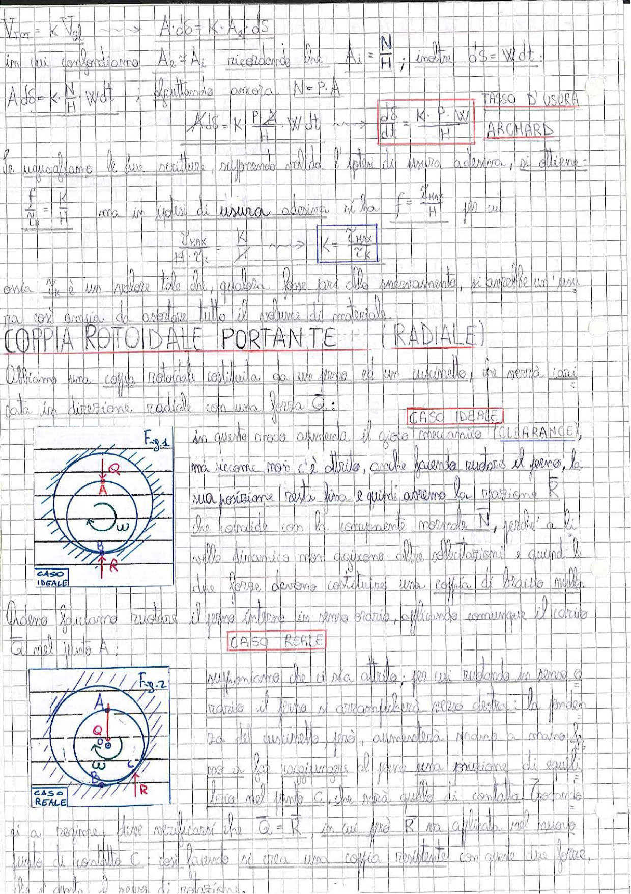

# Page 64 - Tasso d'usura (Archard) e Coppia Rotoidale Portante (Radiale)

## Legge di Archard - Tasso d'usura

$V_{tot} = K \cdot V_d$ $\longrightarrow$ $A \cdot d\delta = K \cdot A_i \cdot dS$

in cui confrontiamo $A_o = A_i$ ricordando che $A_i = \frac{N}{H}$; inoltre $dS = W \cdot dt$:

$$A \cdot d\delta = K \cdot \frac{N}{H} \cdot W \cdot dt$$

sfruttando ancora $N = P \cdot A$:

$$A \cdot dS = K \cdot \frac{P \cdot A}{H} \cdot W \cdot dt \longrightarrow \boxed{\frac{d\delta}{dt} = \frac{K \cdot P \cdot W}{H}} \quad \text{TASSO D'USURA - ARCHARD}$$

Se uguagliamo le due scritture, supponendo valida l'ipotesi di usura adesiva, si ottiene:

$$\frac{f}{\frac{V}{t_R}} = \frac{K}{f} \quad \text{ma in ipotesi di usura adesiva si ha} \quad f = \frac{\tau_{max}}{H} \quad \text{per cui}$$

$$\frac{\tau_{max}}{H \cdot \tau_k} \longrightarrow \boxed{K = \frac{\tau_{max}}{\tau_k}}$$

ossia $\tau_k$ è un valore tale che, qualora fosse pari allo snervamento, si avrebbe un'usura così ampia da asportare tutto il volume di materiale.

---

## COPPIA ROTOIDALE PORTANTE (RADIALE)

Abbiamo una coppia rotoidale costituita da un perno ed un cuscinetto, che verrà caricata in direzione radiale con una forza $\vec{Q}$:

### CASO IDEALE

> 
> Diagramma: Fig. 1 - Coppia rotoidale portante caso ideale: perno dentro cuscinetto con forza Q applicata verso il basso nel punto A, reazione R verso l'alto nel punto B, rotazione ω in senso orario

In questo modo aumenta il gioco meccanico (CLEARANCE), ma siccome non c'è attrito, anche facendo ruotare il perno, la sua posizione resta fissa e quindi avremo la reazione $\vec{R}$ che coincide con la componente normale $\vec{N}$, perché a livello dinamico non agiscono altre sollecitazioni e quindi le due forze devono costituire una coppia di braccio nullo.

### CASO REALE

Adesso facciamo ruotare il perno intorno in senso orario, applicando comunque il carico $\vec{Q}$ nel punto A:

> 
> Diagramma: Fig. 2 - Coppia rotoidale portante caso reale: perno dentro cuscinetto con attrito, il perno si arrampica verso destra fino al punto di contatto C, forza Q applicata in A, reazione R nel punto B, rotazione ω in senso orario

Supponiamo che ci sia attrito; per cui ruotando in senso orario il perno si arrampicherà verso destra; la pendenza del cuscinetto, però, aumenterà andando a mano a mano a far raggiungere al perno una posizione di equilibrio nel punto C, che sarà quello di contatto. Essendo di a regime, deve verificarsi che $\vec{Q} = \vec{R}$, in cui però $\vec{R}$ va applicata nel nuovo punto di contatto C: così facendo si crea una **coppia resistente** con queste due forze, che si oppone al senso di rotazione.
