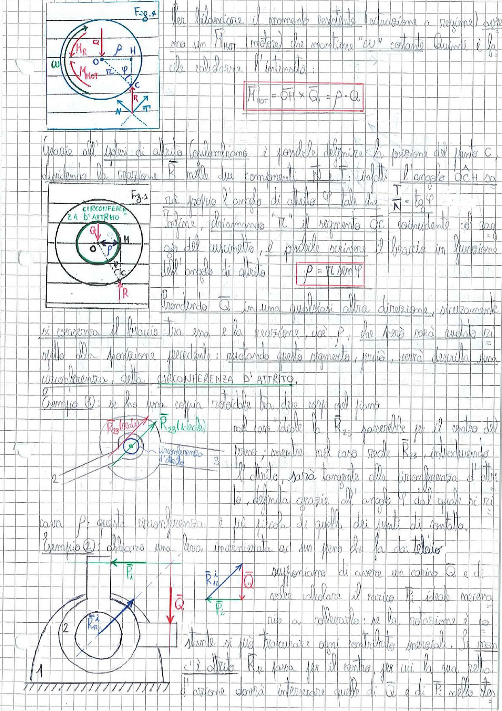

# Page 65 - Circonferenza d'attrito e momento resistente

## Momento resistente (Fig. 4)

Per bilanciare il momento resistente (equazione a regime) aspiriamo un $M_{MOT}$ (motore) che mantenga "$\omega$" costante. Quindi è facile calcolarne l'intensità:

$$\boxed{M_{MOT} = \overline{OH} \times \bar{Q} = \rho \cdot Q}$$

> 
> Diagramma: Fig. 4 - Schema del perno con forze Q, R, reazione N e T, punto C di contatto, momento motore $M_{MOT}$ e momento resistente $M_{Mot}$, con indicazione del braccio $\rho$ e del punto H.

## Relazione con l'angolo di attrito

Grazie all'ipotesi di attrito coulombiano è possibile definire la posizione del punto C dividendo la reazione $\vec{R}$ nelle due componenti $\vec{N}$ e $\vec{T}$: infatti l'angolo $\hat{OCH}$ non è altro che l'angolo di attrito $\varphi$ tale che $\frac{T}{N} = \tan\varphi$.

Infine, chiamando "$r$" il segmento $\overline{OC}$ coincidente col raggio del cuscinetto, è possibile scrivere il braccio in funzione dell'angolo di attrito:

$$\boxed{\rho = r \sin\varphi}$$

> 
> Diagramma: Fig. 3 - Circonferenza d'attrito con centro O, raggio del cuscinetto, punto di contatto C, forza Q applicata e reazione R, con evidenziata la circonferenza d'attrito (cerchio interno verde).

## Circonferenza d'attrito

Prendendo $\vec{Q}$ in una qualsiasi altra direzione, sicuramente si conserva il braccio tra essa e la reazione, cioè $\rho$, che però sarà uguale risultato alla posizione precedente: ruotando questo segmento, perciò, verrà descritta una circonferenza detta **CIRCONFERENZA D'ATTRITO**.

## Esempio ①: coppia rotoidale tra due corpi nel piano

Se ho una coppia rotoidale tra due corpi nel piano:

Nel caso ideale la $R_{23}$ passerebbe per il centro del torno; mentre nel caso reale $R_{23}$, introducendo l'attrito, sarà tangente alla circonferenza d'attrito, definita grazie all'angolo $\varphi$ dal quale si ricava $\rho$: questa circonferenza è più piccola di quella dei giunti di contatto.

> 
> Diagramma: Schema di coppia rotoidale tra corpi 2 e 3, con $R_{23}$ (reale) e $R_{23}$ (ideale), e circonferenza d'attrito indicata al centro del giunto.

## Esempio ②: biella incernierata ad un perno su un basamento (telaio)

Supponiamo di avere un carico $\vec{Q}$ e di voler calcolare il carico $P_i$ ideale necessario a sollevarlo: se la rotazione è costante si può trascurare ogni contributo inerziale. Se non c'è attrito $R_{12}$ passa per il centro, per cui la sua retta d'azione risulta intersecante quella di $\vec{Q}$ e di $\vec{P}$ nello stesso punto.

> 
> Diagramma: Schema di una leva incernierata ad un perno su basamento (telaio), con corpo 1 (base tratteggiata), corpo 2 (biella), forze $\vec{P_1}$, $\vec{P_2}$, $\vec{Q}$, reazione $R_{12}$ e relativa circonferenza d'attrito al perno.
