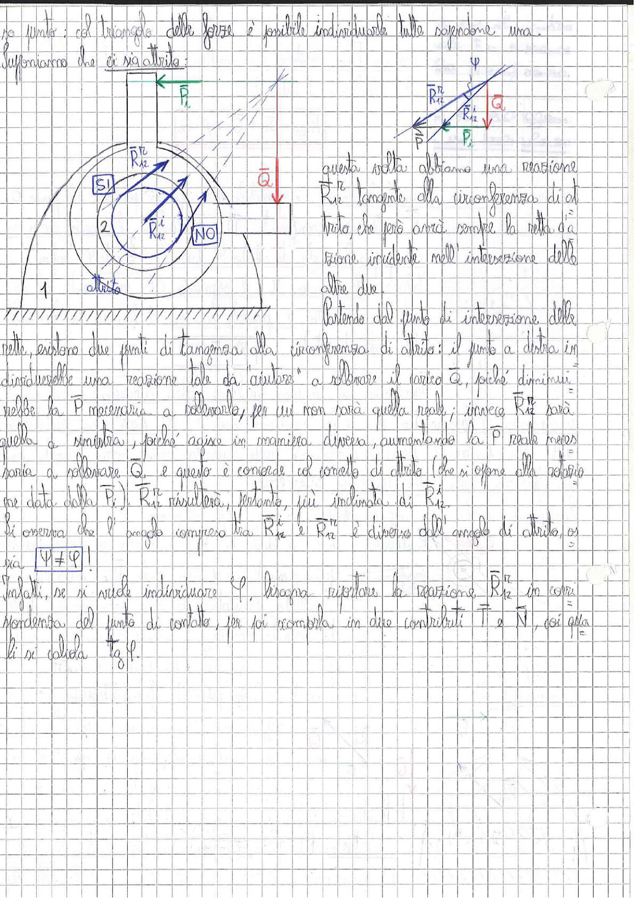

# Page 66 - Attrito nelle coppie rotoidali (circonferenza di attrito)

no punto; col triangolo delle forze è possibile individuarle tutte e scegliere una.

Supponiamo che ci sia attrito:

> 
> Diagramma: Coppia rotoidale con circonferenza di attrito. A sinistra: perno (corpo 2) inserito in una sede (corpo 1) con indicazione della circonferenza di attrito e delle reazioni $\bar{R}_{12}^n$ (SI) e $\bar{R}_{12}^i$ (NO). A destra in alto: triangolo delle forze con angolo $\psi$, reazioni $\bar{R}_{12}^n$, $\bar{R}_{12}^i$, carico $\bar{Q}$ e peso $\bar{P}_2$. Il sistema è vincolato a una guida con attrito (superficie tratteggiata).

Questa volta abbiamo una reazione $\bar{R}_{12}$ tangente alla circonferenza di attrito, che però avrà sempre la retta d'azione incidente nell'intersezione delle altre due.

Partendo dal punto di intersezione delle rette, esistono due punti di tangenza alla circonferenza di attrito: il punto a destra in cui si individuerebbe una reazione tale da "aiutare" a sollevare il carico $\bar{Q}$, poiché diminuirebbe la $\bar{P}$ necessaria a sollevarlo, per cui non sarà quella reale; invece $\bar{R}_{12}^n$ sarà quella a sinistra, poiché agisce in maniera diversa, aumentando la $\bar{P}$ reale necessaria a sollevare $\bar{Q}$, e questo è concorde col concetto di attrito (che si oppone alla soluzione data dalla $\bar{P}_2$). $\bar{R}_{12}^n$ risulterà, pertanto, più inclinata di $\bar{R}_{12}^i$.

Si osserva che l'angolo compreso tra $\bar{R}_{12}^i$ e $\bar{R}_{12}^n$ è diverso dall'angolo di attrito, ossia:

$$\boxed{\psi \neq \varphi}$$

Infatti, se si vuole individuare $\varphi$, bisogna riportare la reazione $\bar{R}_{12}^n$ in corrispondenza del punto di contatto, per poi scomporla in due contributi $\vec{T}$ e $\vec{N}$, poi da lì si calcola $\tan \varphi$.
