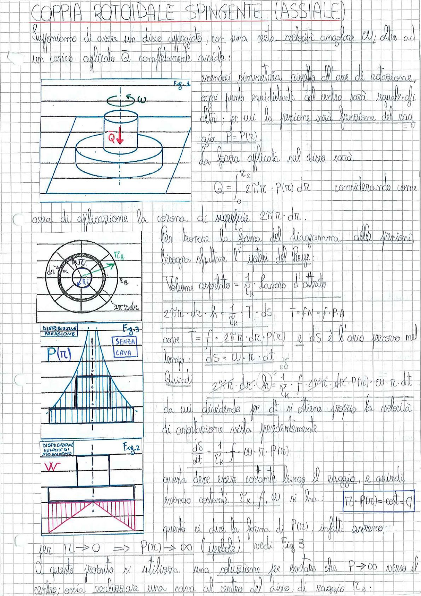

# Page 67 - Coppia Rotoidale Spingente (Assiale)

## COPPIA ROTOIDALE SPINGENTE (ASSIALE)

Supponiamo di avere un disco appoggiato, con una certa velocità angolare $\omega$; oltre ad un carico applicato $Q$ completamente assiale:

> 
> Diagramma: Fig.1 - Disco appoggiato con velocità angolare $\omega$ e carico assiale $Q$ applicato verso il basso. Si vede il disco dall'alto e di lato con la superficie di contatto a corona circolare.

Essendoci simmetria rispetto all'asse di rotazione, ogni punto equidistante dal centro sarà uguale agli altri; per cui la pressione sarà funzione del raggio:

$$P = P(r)$$

La forza applicata sul disco sarà

$$Q = \int_0^{r_2} 2\tilde{\pi} r \cdot P(r) \, dr \qquad \text{considerando come}$$

area di applicazione la corona di superficie $2\tilde{\pi} r \cdot dr$.

---

Per trovare la forma del diagramma delle pressioni, bisogna sfruttare l'ipotesi del Reye:

> 
> Diagramma: Fig.2 - Vista dall'alto del disco con corona circolare di raggio interno $r_0$ e raggio esterno $r_2$, con elemento infinitesimo $dr$ e arco $2\pi r \cdot dr$. Fig.3 - Distribuzione della pressione $P(r)$ senza cava (triangolare divergente verso il centro) e distribuzione della velocità di strisciamento $W$ (lineare crescente verso l'esterno).

$$\text{Volume asportato} = \frac{1}{\tilde{c}_K} \cdot \text{lavoro d'attrito}$$

$$2\tilde{\pi} r \cdot dr \cdot h = \frac{1}{\tilde{c}_K} \cdot T \cdot dS \qquad T = fN = f \cdot P \cdot A$$

dove $T = f \cdot 2\tilde{\pi} r \cdot dr \cdot P(r)$ e $dS$ è l'arco percorso nel tempo:

$$dS = \omega \cdot r \cdot dt$$

Quindi:

$$2\tilde{\pi} r \cdot dr \cdot h = \frac{1}{\tilde{c}_K} \cdot f \cdot 2\tilde{\pi} r \cdot dr \cdot P(r) \cdot \omega \cdot r \cdot dt$$

da cui dividendo per $dt$ si ottiene proprio la velocità di asportazione vista precedentemente:

$$\boxed{\frac{d\delta}{dt} = \frac{1}{\tilde{c}_K} \cdot f \cdot \omega \cdot r \cdot P(r)}$$

questa deve essere costante lungo il raggio, e quindi essendo costanti $\tilde{c}_K$, $f$, $\omega$ si ha:

$$\boxed{r \cdot P(r) = \text{cost} = C}$$

questo ci dice la forma di $P(r)$, infatti avremo:

per $r \to 0 \implies P(r) \to \infty$ (iperbole). Vedi Fig. 3

A questo proposito si utilizza una soluzione per evitare che $P \to \infty$ verso il centro; ossia realizzare una cava al centro del disco, di raggio $r_c$:
