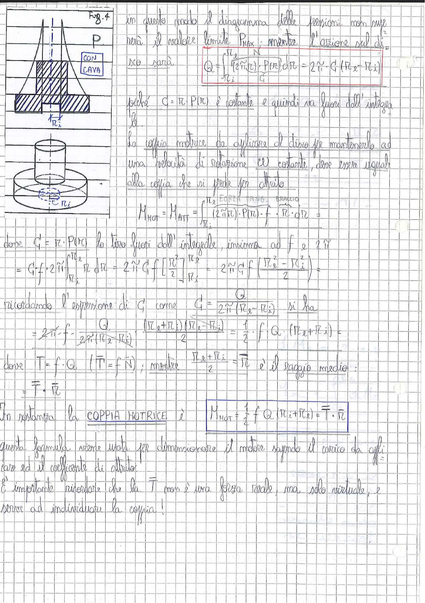

# Page 68 - Coppia motrice nel disco con cava (attrito)

> 
> Diagramma: Fig. 4 - Disco conico con cava e perno cilindrico, vista laterale e prospettica del contatto disco-superficie di appoggio con indicazione dei raggi interno $R_i$ ed esterno $R_e$.

In questo modo il diagramma delle pressioni non supererà il valore limite $P_{MAX}$; mentre l'azione sul disco sarà:

$$\boxed{Q = \int_{R_i}^{R_e} (2\pi R) \cdot P(R) \, dR = 2\pi \cdot G \cdot (R_e - R_i)}$$

poiché $G = R \cdot P(R)$ è costante e quindi va fuori dall'integrale.

La coppia motrice da applicare al disco per mantenerlo ad una velocità di rotazione $\omega$ costante, deve essere uguale alla coppia che si perde per attrito:

$$M_{MOT} = M_{ATT} = \int_{R_i}^{R_e} \underbrace{(2\pi R)}_{\text{}} \cdot \underbrace{P(R)}_{\text{FORZA TANG.}} \cdot \underbrace{f}_{\text{}} \cdot \underbrace{R}_{\text{BRACCIO}} \cdot dR =$$

dove $G = R \cdot P(R)$ la tiro fuori dall'integrale, insieme ad $f$ e $2\pi$:

$$= G \cdot f \cdot 2\pi \int_{R_i}^{R_e} R \, dR = 2\pi \cdot G \cdot f \cdot \left[\frac{R^2}{2}\right]_{R_i}^{R_e} = 2\pi \cdot G \cdot f \cdot \left(\frac{R_e^2 - R_i^2}{2}\right) =$$

ricordando l'espressione di $G$ come $G = \dfrac{Q}{2\pi(R_e - R_i)}$ si ha:

$$= 2\pi \cdot f \cdot \frac{Q}{2\pi(R_e - R_i)} \cdot \frac{(R_e + R_i)(R_e - R_i)}{2} = \frac{1}{2} \cdot f \cdot Q \cdot (R_e + R_i) =$$

dove $T = f \cdot Q$ ($|\vec{T}| = f \cdot N$); mentre $\dfrac{R_e + R_i}{2} = \bar{R}$ è il raggio medio:

$$= \bar{T} \cdot \bar{R}$$

In sostanza la **COPPIA MOTRICE** è:

$$\boxed{M_{MOT} = \frac{1}{2} f \cdot Q \cdot (R_i + R_e) = \bar{T} \cdot \bar{R}}$$

Questa formula viene usata per dimensionare il motore sapendo il carico da applicare ed il coefficiente di attrito.

È importante ricordare che la $\bar{T}$ non è una forza reale, ma solo virtuale, e serve ad individuare la coppia!
