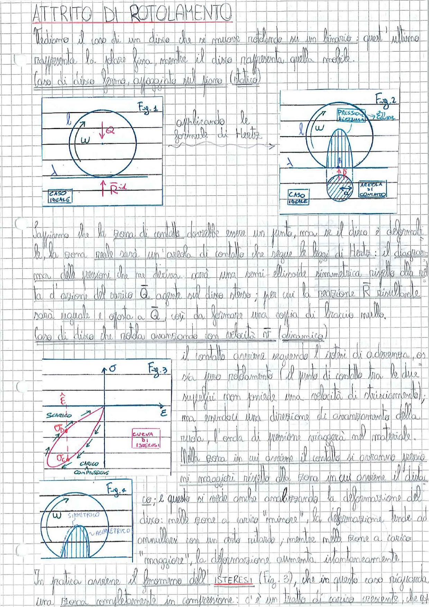

# Page 69 - Attrito di Rotolamento

## ATTRITO DI ROTOLAMENTO

Vediamo il caso di un disco che si muove rotolando su un binario: quest'ultimo rappresenta lo statore fisso, mentre il disco rappresenta quello mobile.

### Caso di disco fermo, appoggiato sul piano (statico)

> 
> Diagramma: Fig. 1 — Disco circolare appoggiato su un piano orizzontale, con carico $\vec{Q}$ verso il basso e reazione $\vec{R}_{id}$ verso l'alto nel caso ideale (contatto puntiforme). Si indicano il raggio $l$ e la velocità angolare $\omega$.

Applicando le formule di Hertz:

> 
> Diagramma: Fig. 2 — Disco su piano con areola di contatto evidenziata (zona tratteggiata). Si mostra il diagramma delle pressioni di contatto con distribuzione semi-ellissoidale, con indicazione della pressione massima e della zona di contatto. Raggio $l$, velocità angolare $\omega$, e zona di carico $\gamma$.

Sappiamo che la zona di contatto dovrebbe essere un punto, ma se il disco è deformabile, la zona reale sarà un'areola di contatto che segue le leggi di Hertz: il diagramma delle pressioni che ne deriva sarà una semi-ellissoide simmetrica rispetto alla retta d'azione del carico $\vec{Q}$ agente sul disco stesso; per cui la reazione $\vec{R}$ risultante sarà uguale e opposta a $\vec{Q}$, così da formare una coppia di braccio nullo.

### Caso di disco che rotola avanzando con velocità $\vec{v}$ (dinamica)

Il contatto avviene seguendo l'isteri di aderenza, ossia puro rotolamento (il punto di contatto tra le due superfici non possiede una velocità di strisciamento); ma essendoci una direzione di avanzamento della ruota, l'onda di pressione viaggerà nel materiale.

> 
> Diagramma: Fig. 3 — Ciclo di isteresi tensione-deformazione ($\sigma$ vs $\varepsilon$). Si evidenziano la curva di carico (compressione, con $\sigma_C$) e la curva di scarico (con $\sigma_D$), mostrando la dissipazione energetica nel ciclo. Indicazione della "curva di isteresi".

> 
> Diagramma: Fig. 4 — Disco in rotolamento con velocità angolare $\omega$, che mostra la distribuzione asimmetrica delle pressioni di contatto rispetto al caso simmetrico (statico).

Nella zona in cui avviene il contatto si avranno pressioni maggiori rispetto alla zona in cui avviene il distacco; e questo si vede anche analizzando la deformazione del disco: nelle zone a carico "minore", la deformazione tende ad annullarsi con un certo ritardo; mentre nelle zone a carico "maggiore", la deformazione aumenta istantaneamente.

In pratica avviene il fenomeno dell'**ISTERESI** (Fig. 3), che in questo caso riguarda una zona completamente in compressione: c'è un tratto di carico crescente che li
