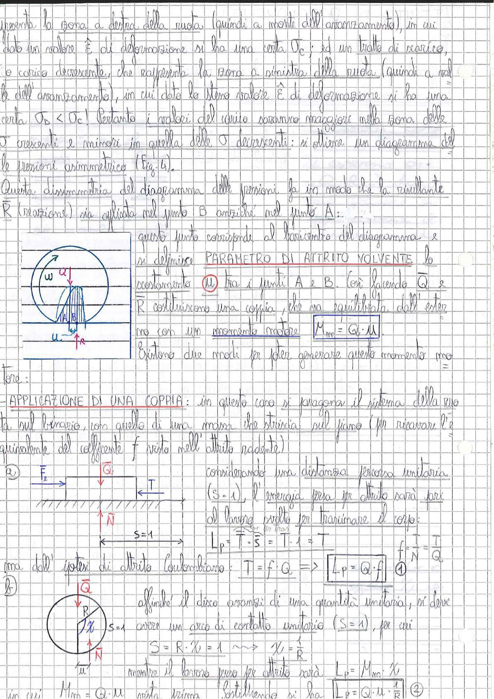

# Page 70 - Attrito Volvente: Parametro e Applicazione di una Coppia

rappresenta la zona a destra della ruota (quindi a monte dell'avanzamento), in cui dato un valore $\bar{E}$ di deformazione si ha una certa $\sigma_c$; ed un tratto di scarico, a carico decrescente, che rappresenta la zona a sinistra della ruota (quindi a valle dell'avanzamento), in cui dato lo stesso valore $\bar{E}$ di deformazione si ha una certa $\sigma_b < \sigma_c$. Pertanto i valori del carico saranno maggiori nella zona delle $\sigma$ crescenti e minori in quella delle $\sigma$ decrescenti: si ottiene un diagramma delle pressioni asimmetrico (Fig. 4).

Questa dissimmetria del diagramma delle pressioni fa in modo che la risultante $\vec{R}$ (reazione) sia applicata nel punto B anziché nel punto A:

> 
> Diagramma: Ruota (disco) su piano con indicazione della velocità angolare $\omega$, angolo $\alpha$, distribuzione asimmetrica delle pressioni sotto la ruota, punti A e B, e parametro di attrito volvente $u$. A destra: schema del corpo trascinato su piano con forze $F_e$, $\vec{Q}$, $T$, $\vec{N}$ e distanza $S=1$. In basso: disco che rotola con arco di contatto unitario $S=1$.

questo punto corrisponde al baricentro del diagramma e si definisce **PARAMETRO DI ATTRITO VOLVENTE** lo scostamento $u$ tra i punti A e B. Così facendo $\vec{Q}$ e $\vec{R}$ costituiscono una coppia, che va equilibrata dall'esterno con un momento motore:

$$\boxed{M_{mo} = Q \cdot u}$$

Esistono due modi per poter generare questo momento motore:

---

## APPLICAZIONE DI UNA COPPIA

In questo caso si paragona il sistema della ruota sul binario, con quello di una massa che striscia sul piano (per ricavare l'equivalente del coefficiente $f$ visto nell'attrito radente).

**(a)** Considerando una distanza percorsa unitaria ($S = 1$), l'energia persa per attrito sarà pari al lavoro svolto per trascinare il corpo:

$$L_p = T \cdot S = T \cdot 1 = T \qquad f = \frac{T}{N} = \frac{T}{Q}$$

ma dall'ipotesi di attrito Coulombiano: $T = f \cdot Q$ $\Rightarrow$

$$\boxed{L_p = Q \cdot f} \quad \textcircled{1}$$

**(b)** Affinché il disco avanzi di una quantità unitaria, si deve avere un arco di contatto unitario ($S = 1$), per cui:

$$S = R \cdot \chi = 1 \quad \sim \! > \quad \chi = \frac{1}{R}$$

mentre il lavoro perso per attrito sarà: $\quad L_p = M_{mo} \cdot \chi$

in cui $M_{mo} = Q \cdot u$ (vista prima). Sostituendo si ha:

$$\boxed{L_p = Q \cdot u \cdot \frac{1}{R}} \quad \textcircled{2}$$
