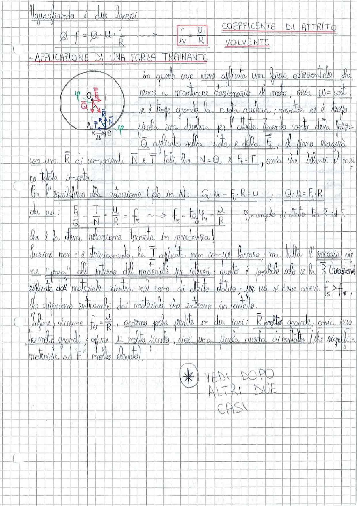

# Page 71 - Coefficiente di Attrito Volvente / Applicazione di una Forza Trainante

Uguagliamo i due lavori:

$$Q \cdot f = Q \cdot \mu \cdot \frac{1}{R} \quad \longrightarrow \quad \boxed{f_v = \frac{\mu}{R}}$$

**COEFFICIENTE DI ATTRITO VOLVENTE**

---

## Applicazione di una Forza Trainante

> 
> Diagramma: ruota di raggio R con centro O, forza peso $\vec{Q}$ verso il basso, forza trainante $\vec{F}_t$ orizzontale, reazioni del piano $\vec{N}$ (normale) e $\vec{T}$ (tangenziale) nel punto di contatto A, angolo $\varphi$ indicato.

In questo caso viene applicata una forza orizzontale che serve a mantenere stazionario il moto, ossia $\omega = \text{cost}$: se è troppo grande la ruota accelera; mentre se è troppo piccola essa decelera per l'attrito. Tenendo conto della forza $\vec{Q}$ applicata sulla ruota e della $\vec{F}_t$, il piano reagirà con una $\vec{R}$ di componenti $\vec{N}$ e $\vec{T}$ tali che $N = Q$ e $F_t = T$, ossia che bilanci il carico totale imposto.

Per l'equilibrio alla rotazione (polo in A): $Q \cdot \mu - F_t \cdot R = 0$ , $Q \cdot \mu = F_t \cdot R$

da cui:

$$\frac{F_t}{Q} = \frac{T}{N} = \frac{\mu}{R} = f_v \quad \longrightarrow \quad f_v = \tan \varphi_v = \frac{\mu}{R}$$

$\varphi_v$ = angolo di attrito tra $\vec{R}$ ed $\vec{N}$

che è la stessa relazione trovata in precedenza!

Siccome non c'è strisciamento, la $\vec{T}$ applicata non compie lavoro; ma tutta l'energia viene "persa" all'interno del materiale per isteresi: questo è possibile solo se la $\vec{R}$ (reazione) esplicata dal materiale rientra nel cono di attrito statico; per cui si deve avere $f_s > f_v$, che dipendono entrambi dai materiali che entrano in contatto.

Infine, siccome $f_v = \frac{\mu}{R}$, avremo forti perdite in due casi: $R$ molto grande, ossia ruote molto grandi; oppure $\mu$ molto piccolo, cioè una piccola area di contatto (che significa materiale ad "E" molto elevato).

---

**※ VEDI DOPO ALTRI DUE CASI**
