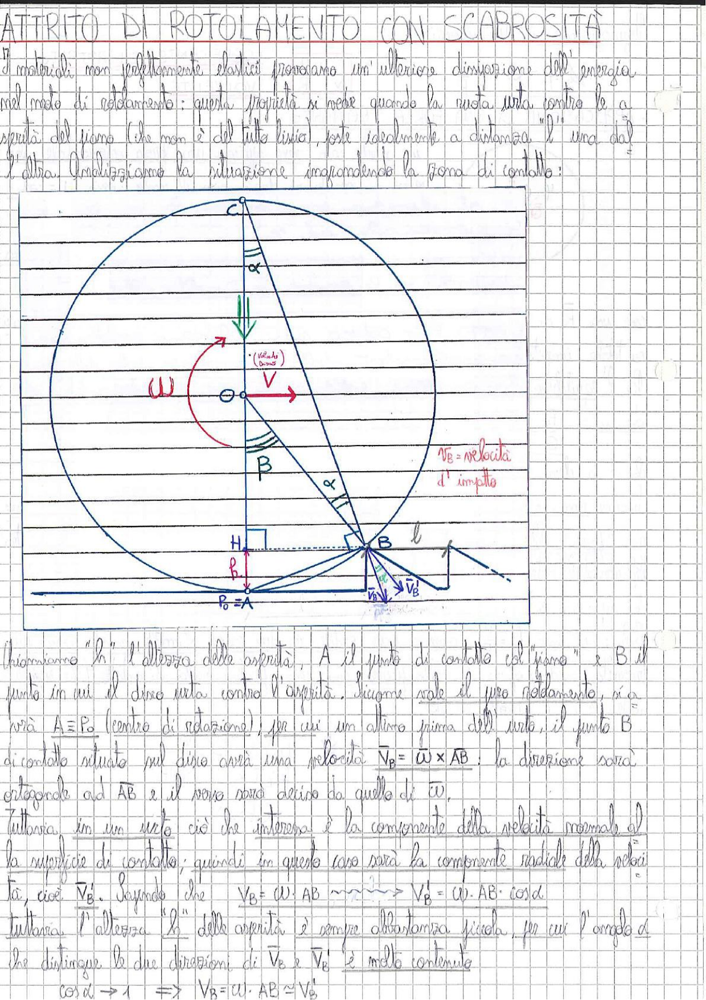

# Page 72 - Attrito di Rotolamento con Scabrosità

I materiali non perfettamente elastici provocano un'ulteriore dissipazione dell'energia, nel moto di rotolamento: questa proprietà si vede quando la ruota urta contro le asperità del piano (che non è del tutto liscio), poste idealmente a distanza l'una dall'altra. Analizziamo la situazione ingrandendo la zona di contatto:

> 
> Diagramma: Disco in rotolamento che urta contro un'asperità del piano. Si vedono il centro O, il punto di contatto A (coincidente con $P_0$, centro di rotazione), il punto B dove il disco urta l'asperità di altezza $h$, il punto C in alto, la velocità $V$ del centro, la velocità angolare $\omega$, l'angolo $\alpha$ e la velocità d'impatto $V_B$ nel punto B.

Chiamiamo "$h$" l'altezza delle asperità, A il punto di contatto col "piano" e B il punto in cui il disco urta contro l'asperità. Siccome vale il puro rotolamento, si avrà $A \equiv P_0$ (centro di rotazione), per cui un attimo prima dell'urto, il punto B di contatto situato sul disco avrà una velocità $\vec{V}_B = \vec{\omega} \times \overline{AB}$: la direzione sarà ortogonale ad AB e il verso sarà detto da quello di $\omega$.

Tuttavia in un urto ciò che interessa è la componente della velocità normale alla superficie di contatto; quindi in questo caso sarà la componente radiale della velocità, cioè $V_B'$. Sapendo che:

$$V_B = \omega \cdot AB \quad \longrightarrow \quad V_B' = \omega \cdot AB \cdot \cos\alpha$$

Tuttavia l'altezza "$h$" delle asperità è sempre abbastanza piccola, per cui l'angolo $\alpha$ che distingue le due direzioni di $\vec{V}_B$ e $\vec{V}_B'$ è molto contenuto:

$$\boxed{\cos\alpha \to 1 \quad \Rightarrow \quad V_B = \omega \cdot AB \simeq V_B'}$$
