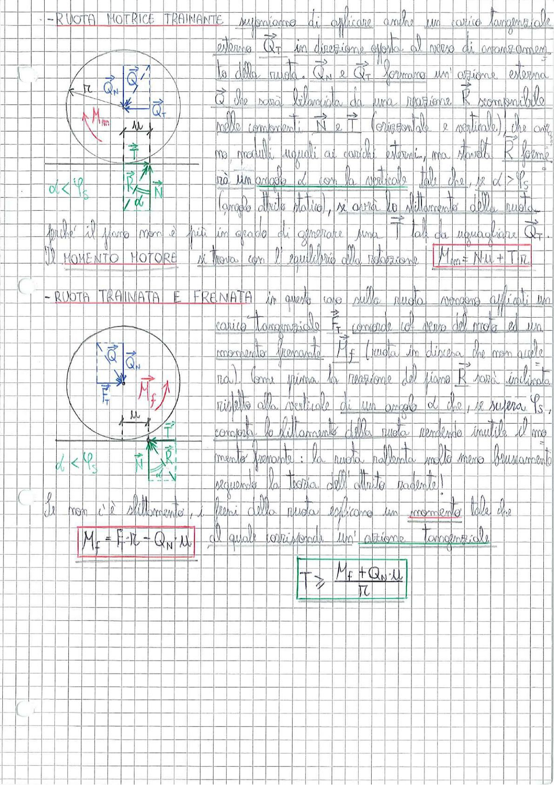

# Page 75 - Ruota motrice trainante e ruota trainata e frenata

## Ruota motrice trainante

Supponiamo di applicare anche un carico tangenziale esterno $\vec{Q}_T$ in direzione opposta al verso di avanzamento della ruota. $\vec{Q}_N$ e $\vec{Q}_T$ formano un'azione esterna $\vec{Q}$ che sarà bilanciata da una reazione $\vec{R}$ scomponibile nelle componenti $\vec{N}$ e $\vec{T}$ (orizzontale e verticale), che avranno moduli uguali ai carichi esterni, ma stavolta $\vec{R}$ formerà un angolo $\alpha$ con la verticale tale che, se $\alpha > \varphi_s$ (angolo attrito statico), si avrà lo slittamento della ruota, poiché il piano non è più in grado di generare una $\vec{T}$ tale da uguagliare $\vec{Q}_T$.

> 
> Diagramma: Ruota motrice trainante con carico normale $Q_N$, carico tangenziale $Q_T$, momento motore $M_m$, reazione del piano $R$ scomposta in $N$ e $T$, con angolo $\alpha < \varphi_s$

Il **MOMENTO MOTORE** si trova con l'equilibrio alla rotazione:

$$\boxed{M_m = N \mu + T r}$$

---

## Ruota trainata e frenata

In questo caso sulla ruota vengono applicati un carico tangenziale $\vec{F}_T$ concorde col senso del moto ed un momento frenante $M_f$ (ruota in discesa che non accelera). Come prima la reazione del piano $\vec{R}$ sarà inclinata rispetto alla verticale di un angolo $\alpha$ che, se supera $\varphi_s$, comporta lo slittamento della ruota rendendo inutile il momento frenante: la ruota rallenta molto meno bruscamente seguendo la teoria dell'attrito radente!

> 
> Diagramma: Ruota trainata e frenata con carico normale $Q_N$, forza tangenziale $F_T$, momento frenante $M_f$, reazione del piano $R$ scomposta in $N$ e $T$, con angolo $\alpha < \varphi_s$

Se non c'è slittamento, i freni della ruota esplicano un momento tale che:

$$\boxed{M_f = F_T \cdot r - Q_N \cdot \mu}$$

al quale corrisponde un'azione tangenziale:

$$\boxed{T > \frac{M_f + Q_N \cdot \mu}{r}}$$
