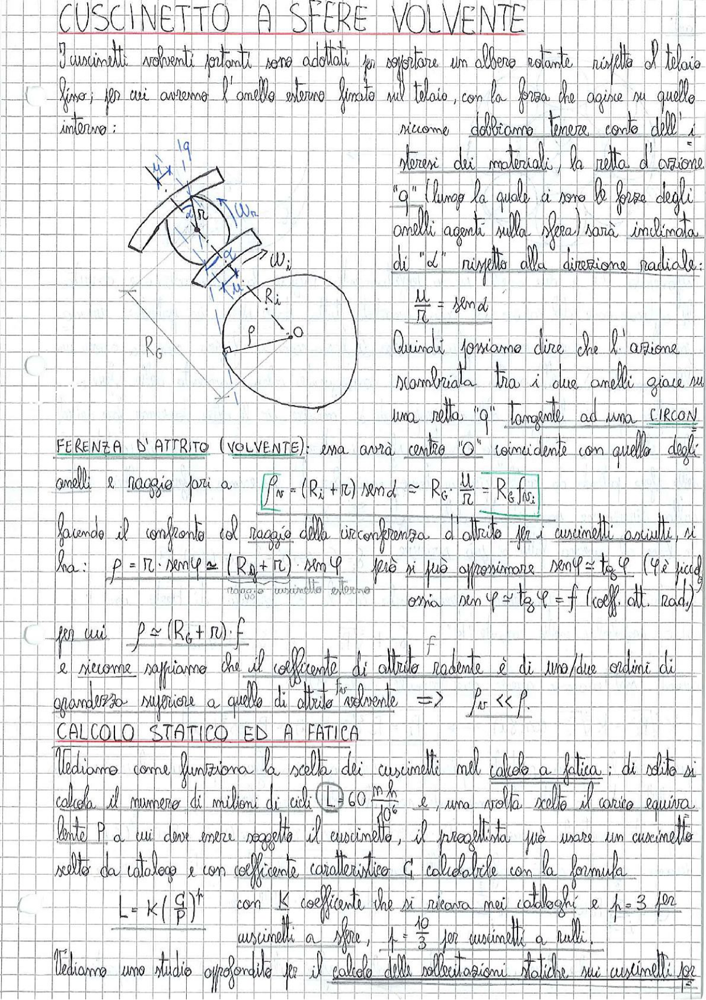

# Page 77 - Cuscinetto a Sfere Volvente

## CUSCINETTO A SFERE VOLVENTE

I cuscinetti volventi (portanti) sono adottati per sopportare un albero rotante rispetto al telaio fisso; per cui avremo l'anello esterno fissato sul telaio, con la forza che agisce su quello interno;

> 
> Diagramma: Schema di un cuscinetto a sfere volvente con indicazione degli anelli interno ed esterno, raggio $R_i$, raggio $R_G$, angolo $\alpha$, forze $W_n$, $W$, e le componenti $\mu$ e $\pi$ sulla sfera

Siccome dobbiamo tenere conto dell'isteresi dei materiali, la retta d'azione "q" (lungo la quale ci sono le forze degli anelli agenti sulla sfera) sarà inclinata di "$d$" rispetto alla direzione radiale:

$$\frac{\mu}{\pi} = \sin d$$

Quindi possiamo dire che l'azione scambiata tra i due anelli giace su una retta "q" tangente ad una **CIRCONFERENZA D'ATTRITO (VOLVENTE)**: essa avrà centro "O" coincidente con quello degli anelli e raggio pari a

$$\boxed{\rho_w = (R_i + \pi) \sin d \simeq R_G \cdot \frac{\mu}{\pi} = R_G \, f_w}$$

Facendo il confronto col raggio della circonferenza d'attrito per i cuscinetti asciutti, si ha:

$$\rho = \pi \cdot \sin \varphi \simeq (R_G + \pi) \cdot \sin \varphi$$

però si può approssimare $\sin \varphi \simeq \tan \varphi$ ($\varphi$ è piccolo)

ossia $\sin \varphi \simeq \tan \varphi = f$ (coeff. att. rad.)

per cui:

$$\boxed{\rho \simeq (R_G + \pi) \cdot f}$$

e siccome sappiamo che il coefficiente di attrito radente è di uno/due ordini di grandezza superiore a quello di attrito volvente $\Rightarrow$ $\rho_w \ll \rho$

---

## CALCOLO STATICO ED A FATICA

Vediamo come funziona la scelta dei cuscinetti nel calcolo a fatica; di solito si calcola il numero di milioni di cicli:

$$\boxed{L = 60 \frac{n \cdot h}{10^6}}$$

e, una volta scelto il carico equivalente $P$ a cui deve essere soggetto il cuscinetto, il progettista può usare un cuscinetto scelto da catalogo e con coefficiente caratteristico $C$ calcolabile con la formula:

$$L = K \left(\frac{C}{P}\right)^p$$

con $K$ coefficiente che si ricava nei cataloghi e $p = 3$ per cuscinetti a sfere, $p = \frac{10}{3}$ per cuscinetti a rulli.

Vediamo uno studio approfondito per il calcolo delle sollecitazioni statiche sui cuscinetti per
