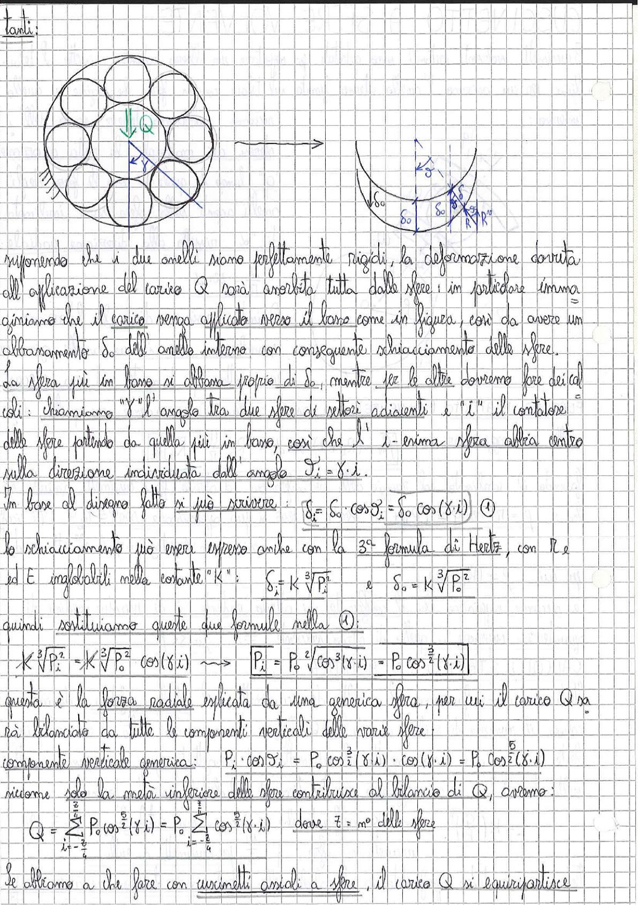

# Page 78 - Cuscinetti a sfere: distribuzione del carico assiale

tanti:

> 
> Diagramma: Vista frontale di un cuscinetto a sfere con carico assiale Q applicato verso il basso, con indicazione dell'angolo γ tra sfere adiacenti; a destra, schema di deformazione che mostra gli schiacciamenti δ₀ e δᵢ delle sfere e i raggi R e R'

Supponendo che i due anelli siano perfettamente rigidi, la deformazione dovuta all'applicazione del carico Q sarà assorbita tutta dalle sfere; in particolare immaginiamo che il carico venga applicato verso il basso come in figura, così da avere un abbassamento $\delta_0$ dell'anello interno con conseguente schiacciamento delle sfere.

La sfera più in basso si abbassa proprio di $\delta_0$, mentre per le altre dovremo fare dei calcoli: chiamiamo "$\gamma$" l'angolo tra due sfere di settori adiacenti e "$i$" il contatore delle sfere partendo da quella più in basso, così che la $i$-esima sfera alzia centro sulla direzione individuata dall'angolo $\vartheta_i = \gamma \cdot i$.

In base al disegno fatto si può scrivere:

$$\boxed{\delta_i = \delta_0 \cdot \cos \vartheta_i = \delta_0 \cos(\gamma \cdot i)} \quad \text{①}$$

Lo schiacciamento può essere espresso anche con la 3ª formula di Hertz, con R e ed E inglobabili nella costante "K":

$$\delta_i = K \sqrt[3]{P_i^2} \qquad e \qquad \delta_0 = K \sqrt[3]{P_0^2}$$

quindi sostituiamo queste due formule nella ①:

$$K \sqrt[3]{P_i^2} = K \sqrt[3]{P_0^2} \cos(\gamma \cdot i) \quad \longrightarrow \quad \boxed{P_i = P_0^2 \sqrt{\cos^3(\gamma \cdot i)} = P_0 \cos^{\frac{3}{2}}(\gamma \cdot i)}$$

questa è la forza radiale esplicata da una generica sfera, per cui il carico Q sarà bilanciato da tutte le componenti verticali delle varie sfere.

Componente verticale generica:

$$P_i \cdot \cos \vartheta_i = P_0 \cos^{\frac{3}{2}}(\gamma \cdot i) \cdot \cos(\gamma \cdot i) = P_0 \cos^{\frac{5}{2}}(\gamma \cdot i)$$

Ricordando che solo la metà inferiore delle sfere contribuisce al bilancio di Q, avremo:

$$Q = \sum_{i=-\frac{z}{4}}^{\frac{z}{4}} P_0 \cos^{\frac{5}{2}}(\gamma \cdot i) = P_0 \sum_{i=-\frac{z}{4}}^{\frac{z}{4}} \cos^{\frac{5}{2}}(\gamma \cdot i) \qquad \text{dove } z = n° \text{ delle sfere}$$

Se abbiamo a che fare con cuscinetti assiali a sfere, il carico Q si equipartisce
