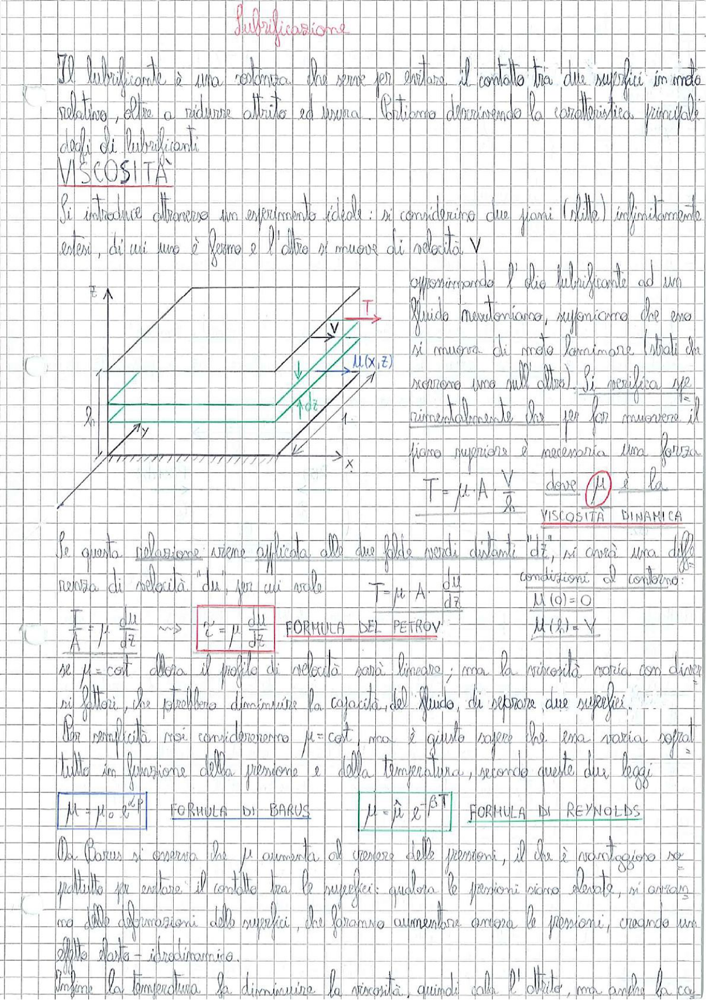

# Page 81 - Lubrificazione

Il lubrificante è una sostanza che serve per evitare il contatto tra due superfici in moto relativo, oltre a ridurre attrito ed usura. Partiamo descrivendo la caratteristica principale degli oli lubrificanti.

## VISCOSITÀ

Si introduce attraverso un esperimento ideale: si considerino due piani (stille) infinitamente estesi, di cui uno è fermo e l'altro si muove di velocità $V$.

> 
> Diagramma: Due piani paralleli infinitamente estesi separati da un fluido lubrificante di spessore $h$. Il piano superiore si muove con velocità $V$ nella direzione $x$, mentre quello inferiore è fermo. È indicato un punto $M(x,z)$ nel fluido, con il profilo di velocità lineare e la forza tangenziale $T$ applicata al piano superiore. Sistema di riferimento con assi $x$ e $z$.

Approssimando l'olio lubrificante ad un fluido newtoniano, supponiamo che esso si muova di moto laminare (strati da scorrere uno sull'altro). Si verifica sperimentalmente che per far muovere il piano superiore è necessaria una forza:

$$T = \mu \cdot A \cdot \frac{V}{h} \qquad \text{dove } \boxed{\mu} \text{ è la}$$

**VISCOSITÀ DINAMICA**

Se questa relazione viene applicata alle due falde posti distanti "$dz$", si avrà una differenza di velocità $du$, per cui vale:

$$T = \mu \cdot A \cdot \frac{du}{dz}$$

Condizioni al contorno:
- $u(0) = 0$
- $u(h) = V$

$$\frac{T}{A} = \mu \cdot \frac{du}{dz} \implies \boxed{\tau = \mu \frac{du}{dz}} \quad \text{FORMULA DEL PETROV}$$

Se $\mu = \text{cost}$ allora il profilo di velocità sarà lineare; ma la viscosità varia con diversi fattori, che potrebbero diminuire la capacità del fluido di separare due superfici.

Per semplicità noi considereremo $\mu = \text{cost}$, ma è giusto sapere che essa varia soprattutto in funzione della pressione e della temperatura, secondo queste due leggi:

$$\boxed{\mu = \mu_0 \cdot e^{\alpha p}} \quad \text{FORMULA DI BARUS} \qquad \boxed{\mu = \hat{\mu} \cdot e^{-\beta T}} \quad \text{FORMULA DI REYNOLDS}$$

Da Barus si osserva che $\mu$ aumenta al crescere della pressione, il che è vantaggioso soprattutto per evitare il contatto tra le superfici: qualora le pressioni siano elevate, si arriva alle deformazioni delle superfici, che faranno aumentare ancora le pressioni, creando un effetto elasto-idrodinamico.

Invece la temperatura fa diminuire la viscosità, quindi cala l'attrito, ma anche la ca-
