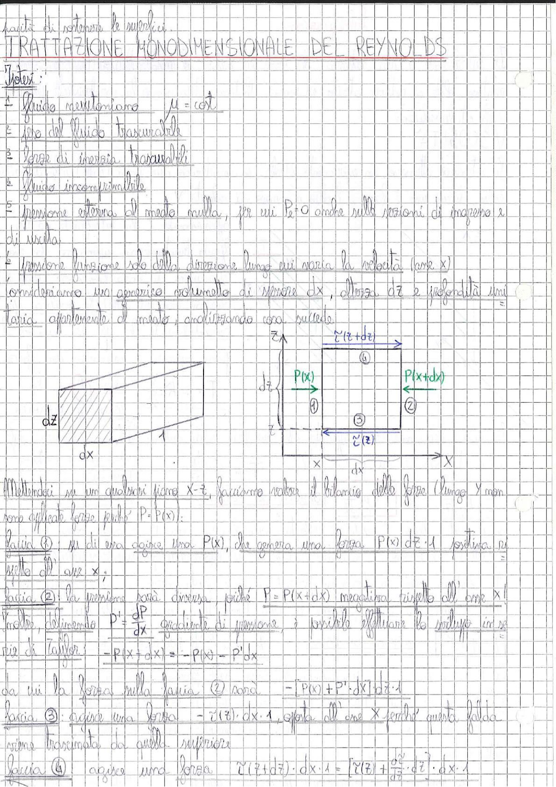

# Page 82 - Trattazione Monodimensionale del Reynolds

*(facilità di contenere le superfici)*

## TRATTAZIONE MONODIMENSIONALE DEL REYNOLDS

**Ipotesi:**

1. Fluido newtoniano: $\mu = \text{cost.}$
2. Peso del fluido trascurabile
3. Forze di inerzia trascurabili
4. Fluido incomprimibile
5. Pressione esterna al meato nulla, per cui $P_e = 0$ onde sulle sezioni di ingresso e di uscita.
6. Pressione funzione solo della direzione lungo cui varia la velocità (asse x)

Consideriamo un generico volumetto di spessore $dx$, altezza $dz$ e profondità unitaria, di aria appartenente al meato, analizzando cosa succede.

> 
> Diagramma: Volume di controllo elementare nel meato con dimensioni $dx \times dz \times 1$. Si mostrano le facce numerate ①②③④ con le rispettive pressioni $P(x)$ e $P(x+dx)$ e le tensioni tangenziali $\tau(z)$ e $\tau(z+dz)$ agenti sulle facce. Sistema di riferimento con asse x orizzontale e asse z verticale.

Mettendoci su un qualsiasi piano $x$-$z$, facciamo valere il bilancio delle forze (lungo $Y$ non sono applicate forze poiché $P = P(x)$):

**Faccia ①:** su di essa agisce una $P(x)$, che genera una forza $P(x) \cdot dz \cdot 1$ positiva rispetto all'asse $x$;

**Faccia ②:** la pressione sarà diversa, poiché $P = P(x+dx)$ maggiore rispetto all'asse $x$. Inoltre, definendo $P' = \frac{dP}{dx}$ gradiente di pressione, è possibile effettuare lo sviluppo in serie di Taylor:

$$-P(x + dx) = -P(x) - P'dx$$

da cui la forza sulla faccia ② sarà: $\quad -[P(x) + P' \cdot dx] \cdot dz \cdot 1$

**Faccia ③:** agisce una forza $-\tau(z) \cdot dx \cdot 1$, opposta all'asse $x$ perché questa falda viene trascinata da quella superiore.

**Faccia ④:** agisce una forza $\tau(z+dz) \cdot dx \cdot 1 = \left[\tau(z) + \frac{d\tau}{dz} \cdot dz\right] \cdot dx \cdot 1$
