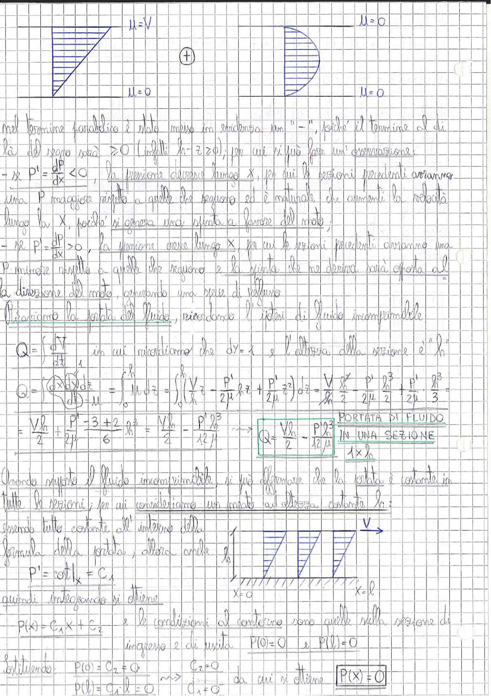

# Page 84 - Portata di fluido e distribuzione di pressione

> 
> Diagramma: Profili di velocità parabolici in una sezione del canale. A sinistra: profilo con velocità massima $u = V$ sulla parete superiore e $u = 0$ sulla parete inferiore (flusso di Couette). A destra: profilo semicircolare/parabolico con $u = 0$ su entrambe le pareti (flusso di Poiseuille). Al centro il simbolo $\oplus$ indica la direzione positiva.

Nel termine parabolico è stato messo in evidenza un "$-$", poiché il termine al di là del segno sarà $\geq 0$ (infatti $h - z \geq 0$), per cui si può fare un'osservazione:

- Se $P' = \frac{dP}{dx} < 0$, la pressione decresce lungo $x$, per cui le sezioni precedenti avranno una $P$ maggiore rispetto a quelle che seguono ed è naturale che aumenti la velocità lungo la $x$, poiché si genera una spinta a favore del moto;

- Se $P' = \frac{dP}{dx} > 0$, la pressione cresce lungo $x$, per cui le sezioni precedenti avranno una $P$ minore rispetto a quelle che seguono e la spinta che ne deriva sarà opposta alla direzione del moto, generando una serie di rallentamenti.

## Portata del fluido

Calcoliamo la portata del fluido, ricordando l'ipotesi di fluido incomprimibile:

$$Q = \int \vec{dV} \cdot \vec{dA}$$

in cui ricordiamo che $dy = 1$ e l'altezza della sezione è $h$.

$$Q = \int_0^h \left(\frac{Q}{A}\right) dz = \int_0^h u \, dz = \int_0^h \left(\frac{V}{h} z - \frac{P'}{2\mu} hz + \frac{P'}{2\mu} z^2\right) dz = \frac{V}{h} \cdot \frac{h^2}{2} - \frac{P'}{2\mu} \cdot \frac{h^3}{2} + \frac{P'}{2\mu} \cdot \frac{h^3}{3}$$

$$= \frac{Vh}{2} + \frac{P'}{2\mu} \cdot \frac{-3 + 2}{6} \cdot h^3 = \frac{Vh}{2} - \frac{P'h^3}{12\mu}$$

$$\boxed{Q = \frac{Vh}{2} - \frac{P'h^3}{12\mu}}$$

**PORTATA DI FLUIDO IN UNA SEZIONE** $1 \times h$

## Distribuzione di pressione

Quando si reputa il fluido incomprimibile, si può affermare che la portata è costante in tutte le sezioni, per cui consideriamo un canale ad altezza costante $h$:

> 
> Diagramma: Canale rettangolare con pareti parallele, sezione di ingresso a $x = a$ e sezione di uscita a $x = l$. La velocità $V$ è indicata con una freccia orizzontale sulla parete superiore. Le pareti inferiori sono tratteggiate (vincolo fisso). Distribuzione di pressione lineare tra le sezioni.

Essendo tutto costante all'interno della formula della portata, allora anche $P'$:

$$P' = \text{cost}|_x = C_1$$

quindi integrando si ottiene:

$$P(x) = C_1 x + C_2$$

e le condizioni al contorno sono quelle sulla sezione di ingresso e di uscita:

$$P(0) = 0 \quad \text{e} \quad P(l) = 0$$

Sostituendo:

$$P(0) = C_2 = 0 \quad \Rightarrow \quad C_2 = 0$$

$$P(l) = C_1 \cdot l = 0 \quad \Rightarrow \quad C_1 = 0$$

da cui si ottiene:

$$\boxed{P(x) = 0}$$
