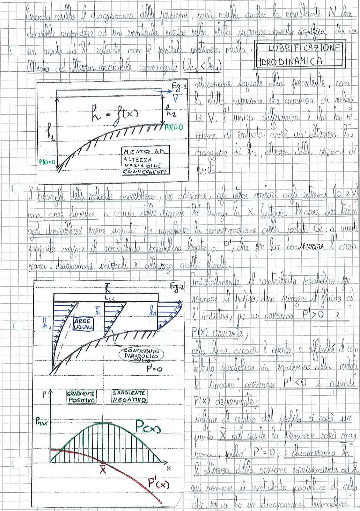

# Page 85 - Lubrificazione Idrodinamica (Meato convergente)

## LUBRIFICAZIONE IDRODINAMICA

Essendo nullo il diagramma delle pressioni, sarà nulla anche la risultante $N$ che dovrebbe rispondere ad un eventuale carico sulla slitta superiore: questo significa che con un meato ad "h" costante non è possibile sostenere nulla!

### Meato ad altezza variabile convergente ($h_2 < h_1$)

> 
> Diagramma: Fig.1 - Meato ad altezza variabile convergente con slitta superiore in movimento a velocità V, profilo $h = f(x)$, altezza $h_1$ in ingresso e $h_2$ in uscita, con $P(0) = 0$ alle estremità. Profili di velocità parabolici mostrati all'interno del meato.

Situazione uguale alla precedente, con la slitta superiore che avanza di velocità $V$. L'unica differenza è che la sezione di entrata avrà un'altezza $h_1$ maggiore di $h_2$, altezza della sezione di uscita.

**MEATO AD ALTEZZA VARIABILE CONVERGENTE**

$P(0) = 0$

I triangoli delle velocità avrebbero, per adesione, gli stessi valori agli estremi (0 e V) ma aree diverse a causa delle diverse "h" lungo la $x$. Tuttavia le aree dei triangoli dovrebbero essere uguali per rispettare la conservazione della portata $Q$: a questo proposito agisce il contributo parabolico legato a $P'$, che per far conservare l'area rana i diagrammi iniziali e allarga quelli finali.

> 
> Diagramma: Fig.2 - Meato convergente con profili di velocità che mostrano le aree uguali tra sezione di ingresso ($h_1$) e sezione di uscita ($h_2$). Contributo parabolico indicato con $P' = 0$ al centro.

Inizialmente il contributo parabolico, per ravvivare il profilo, deve spingere il fluido all'indietro; per cui avremo $P' > 0$ e $P(x)$ crescente;

alla fine accade l'opposto, e affinché il contributo parabolico sia equiverso alla velocità "lineare", avremo $P' < 0$ e quindi $P(x)$ decrescente;

infine al centro del profilo ci sarà un punto $\bar{x}$ nel quale la pressione sarà massima, poiché $P' = 0$; e chiameremo $h_*$ l'altezza della sezione corrispondente ad $\bar{x}$: qui scompare il contributo parabolico di velocità, per cui ho un diagramma triangolare.

> 
> Diagramma: Grafico della pressione $P(x)$ e del gradiente $P'(x)$ in funzione di $x$. La pressione $P$ parte da zero, cresce fino a $P_{MAX}$ nel punto $\bar{x}$ (gradiente positivo), poi decresce (gradiente negativo). Il gradiente $P'(x)$ parte positivo, passa per zero in $\bar{x}$, e diventa negativo.
