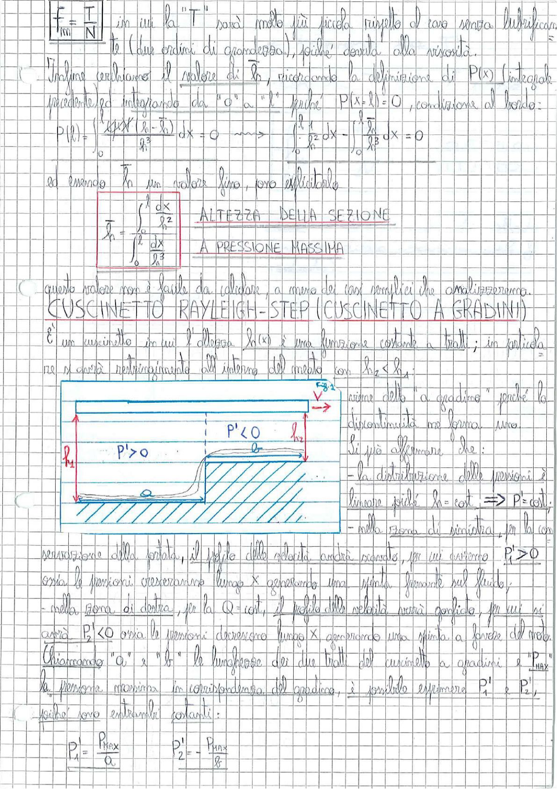

# Page 87 - Cuscinetto Rayleigh-Step (Cuscinetto a Gradini)

$$\boxed{f = \frac{T}{N}}$$

in cui la "T" sarà molto più piccola rispetto al caso senza lubrificante (due ordini di grandezza), poiché dovuta alla viscosità.

Infine cerchiamo il valore di $h_n$, ricordando la definizione di $P(x)$ (integrabile precedentemente) integrando da "0" a "l" poiché $P(x=l) = 0$, condizione al bordo:

$$P(l) = \int_0^l \frac{6\mu V (h - h_n)}{h^3} \, dx = 0 \quad \longrightarrow \quad \int_0^l \frac{h^2}{h^3} dx - \int_0^l \frac{h_n}{h^3} dx = 0$$

ed essendo $h_n$ un valore fino, sono esplicitabili:

$$\boxed{h_n = \frac{\int_0^l \frac{dx}{h^2}}{\int_0^l \frac{dx}{h^3}}} \quad \text{ALTEZZA DELLA SEZIONE A PRESSIONE MASSIMA}$$

Questo valore non è facile da calcolare, a meno dei casi semplici che analizzeremo.

---

## CUSCINETTO RAYLEIGH-STEP (CUSCINETTO A GRADINI)

È un cuscinetto in cui l'altezza $h(x)$ è una funzione costante a tratti; in particolare si avrà restringimento all'interno del meato con $h_2 < h_1$.

> 
> Diagramma: Sezione del cuscinetto Rayleigh-Step con due zone a diversa altezza del meato ($h_1$ e $h_2$), profilo di pressione triangolare con $P' > 0$ nella zona sinistra (lunghezza $a$) e $P' < 0$ nella zona destra (lunghezza $b$), con velocità $V$ verso destra.

Viene detto "a gradino" perché la discontinuità ha forma di uno.

Si può affermare che:

- la distribuzione delle pressioni è lineare poiché $h = \text{cost} \Rightarrow P' = \text{cost}$;
- nella zona di sinistra, per la conservazione della portata, il profilo delle velocità andrà ristretto, per cui avremo $P_1' > 0$ ossia le pressioni cresceranno lungo $x$ generando una spinta favorevole sul fluido;
- nella zona di destra, per la $Q = \text{cost}$, il profilo delle velocità verrà gonfiato, per cui si avrà $P_2' < 0$ ossia le pressioni decrescono lungo $x$ generando una spinta a favore del moto.

Chiamando "$a$" e "$b$" le lunghezze dei due tratti del cuscinetto a gradini e "$P_{max}$" la pressione massima in corrispondenza del gradino, è possibile esprimere $P_1'$ e $P_2'$, poiché sono entrambi costanti:

$$P_1' = \frac{P_{max}}{a} \qquad P_2' = -\frac{P_{max}}{b}$$
