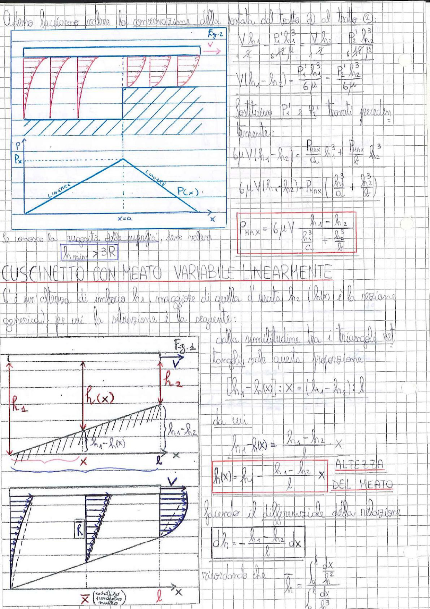

# Page 88 - Cuscinetto con meato variabile linearmente

## Conservazione della portata dal tratto (1) al tratto (2)

Adesso facciamo valere la conservazione della portata dal tratto (1) al tratto (2):

$$\frac{V h_1}{2} - \frac{P_1' h_1^3}{6 \cdot 12 \mu} = \frac{V h_2}{2} - \frac{P_2' h_2^3}{6 \cdot 12 \mu}$$

$$V(h_1 - h_2) + \frac{P_1' h_1^3}{6\mu} = \frac{P_2' h_2^3}{6\mu}$$

Sostituisco $P_1'$ e $P_2'$ trovati precedentemente:

$$6\mu V (h_1 - h_2) = \frac{P_{MAX}}{a} h_1^3 + \frac{P_{MAX}}{b} h_2^3$$

$$6\mu V (h_1 - h_2) = P_{MAX} \left( \frac{h_1^3}{a} + \frac{h_2^3}{b} \right)$$

$$\boxed{P_{MAX} = 6\mu V \frac{h_1 - h_2}{\dfrac{h_1^3}{a} + \dfrac{h_2^3}{b}}}$$

> 
> Diagramma: Distribuzione di pressione triangolare (lineare a tratti) con profilo del meato a gradino; grafico di P(x) con andamento lineare crescente fino a $P_x$ e poi decrescente, con x=a indicato

Se si conosce la rugosità delle superfici, deve valere:

$$\boxed{h_{min} > 3|R|}$$

---

## CUSCINETTO CON MEATO VARIABILE LINEARMENTE

C'è un'altezza di imbocco $h_1$, maggiore di quella d'uscita $h_2$ ($h(x)$ è la sezione generica); per cui la relazione è la seguente:

Dalla similitudine tra i triangoli nel grafico vale questa proporzione:

$$[h_1 - h(x)] : x = (h_1 - h_2) : l$$

da cui:

$$h_1 - h(x) = \frac{h_1 - h_2}{l} \cdot x$$

$$\boxed{h(x) = h_1 - \frac{h_1 - h_2}{l} \cdot x} \quad \text{ALTEZZA DEL MEATO}$$

Facendo il differenziale della relazione:

$$dh = -\frac{h_1 - h_2}{l} \, dx$$

ricordando che:

$$\int_h = \int_0^l \frac{dx}{h^2} = \frac{l}{h_1 - h_2} \int \frac{dh}{h^3}$$

> 
> Diagramma: Schema del cuscinetto con meato variabile linearmente; si vede la piastra superiore in movimento con velocità V, l'altezza h₁ all'ingresso, h₂ all'uscita, h(x) nella sezione generica, e la distanza l. Sotto: profilo di velocità nel meato con distribuzione parabolica tipica della lubrificazione.
