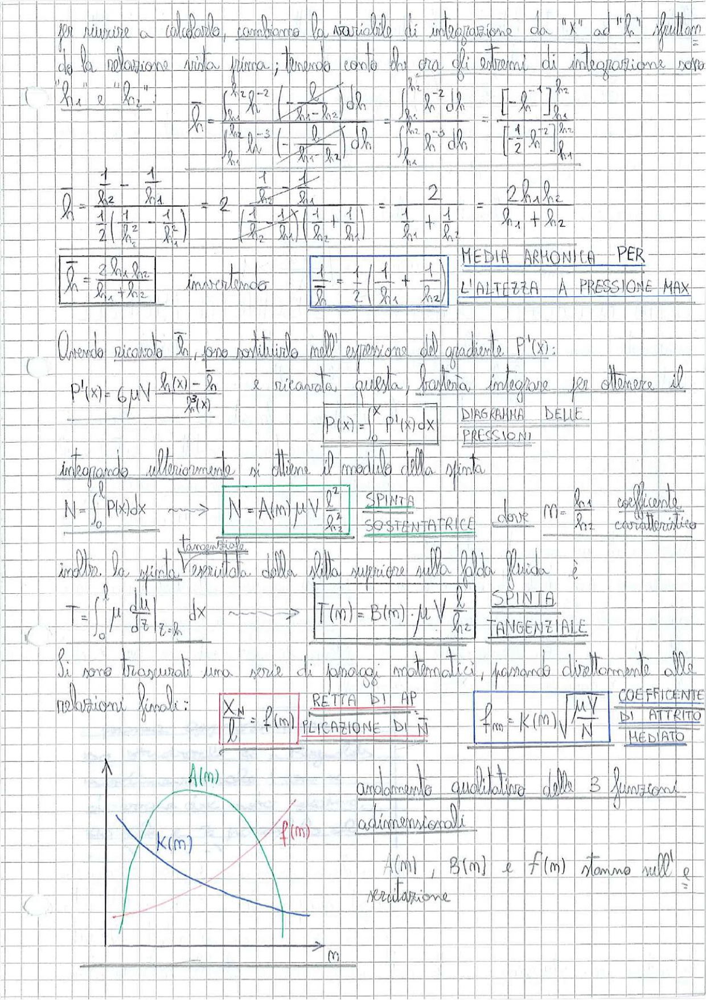

# Page 89 - Cuscinetto a pattino (calcolo di $\bar{h}$, spinta e coefficiente d'attrito)

Per riuscire a calcolarlo, cambiamo la variabile di integrazione da "$x$" ad "$h$" sfruttando la relazione vista prima; tenendo conto che ora gli estremi di integrazione sono "$h_1$" e "$h_2$":

$$\frac{\overline{h}}{h_1} = \frac{\frac{h_2}{h_2^{-2}}}{{\frac{h_2}{h_2}}^{-3}} \cdot \frac{\int_{h_1}^{h_2} \frac{\ell}{(h_1 - h_2)} \frac{\ell}{dh}}{\int_{h_1}^{h_2} \left( -\frac{\ell}{h_1 - h_2} \right) \frac{\ell}{dh}} = \frac{\frac{h_2^{-2}}{h_2^{-2}} \cdot \frac{\ell}{dh}}{\frac{h_2^{-2}}{h_2^{-3}} \cdot dh} = \frac{\left[-h^{-1}\right]_{h_1}^{h_2}}{\left[\frac{1}{2} h^{-2}\right]_{h_1}^{h_2}}$$

$$\bar{h} = \frac{\frac{1}{h_2} - \frac{1}{h_1}}{\frac{1}{2}\left(\frac{1}{h_2^2} - \frac{1}{h_1^2}\right)} = 2 \cdot \frac{\frac{1}{h_2} - \frac{1}{h_1}}{\frac{1}{h_2} \cdot \frac{1}{h_1} \left(\frac{1}{h_2} + \frac{1}{h_1}\right)} = \frac{2}{\frac{1}{h_1} + \frac{1}{h_2}} = \frac{2\, h_1\, h_2}{h_1 + h_2}$$

$$\boxed{\bar{h} = \frac{2\, h_1\, h_2}{h_1 + h_2}} \quad \text{inserendo} \quad \boxed{\frac{1}{\bar{h}} = \frac{1}{2}\left(\frac{1}{h_1} + \frac{1}{h_2}\right)} \quad \text{MEDIA ARMONICA PER L'ALTEZZA A PRESSIONE MAX}$$

---

Avendo ricavato $\bar{h}$, ora sostituiamo nell'espressione del gradiente $P'(x)$:

$$P'(x) = 6\,\mu\, V \frac{h(x) - \bar{h}}{h^3(x)}$$

e ricavata questa, basterà integrare per ottenere il **DIAGRAMMA DELLE PRESSIONI**:

$$P(x) = \int_0^x P'(x)\, dx$$

---

Integrando ulteriormente si ottiene il modulo della spinta:

$$N = \int_0^\ell P(x)\, dx \quad \longrightarrow \quad \boxed{N = A(m)\,\mu\, V \frac{\ell^2}{h_2^2}} \quad \text{SPINTA SOSTENTATRICE}$$

dove $m = \frac{h_1}{h_2}$ è il **coefficiente caratteristico**.

---

Inoltre la spinta tangenziale della lastra superiore sulla falda fluida è:

$$T = \int_0^\ell \mu \frac{du}{dz}\bigg|_{z=h}\, dx \quad \longrightarrow \quad \boxed{T(m) = B(m) \cdot \mu\, V \frac{\ell}{h_2}} \quad \text{SPINTA TANGENZIALE}$$

---

Si sono trascurati una serie di passaggi matematici, passando direttamente alle relazioni finali:

$$\boxed{\frac{X_N}{\ell} = f(m)} \quad \text{RETTA DI APPLICAZIONE DI } N$$

$$\boxed{f_m = K(m)\sqrt{\frac{\mu\, V}{N}}} \quad \text{COEFFICIENTE DI ATTRITO MEDIATO}$$

---

> 
> Diagramma: Andamento qualitativo delle 3 funzioni adimensionali $A(m)$, $B(m)$ e $f(m)$ in funzione del parametro $m$. $K(m)$ è decrescente, $A(m)$ presenta un massimo, $f(m)$ è crescente. Le tre funzioni stanno nell'esercitazione.
