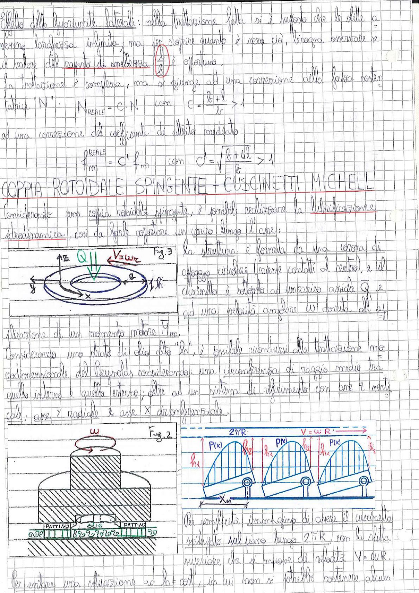

# Page 90 - Coppia Rotoidale Spingente - Cuscinetti Michell

## Effetto delle fuoriuscite laterali

Effetto delle fuoriuscite laterali: nella trattazione fatta si è supposto che le slitte avessero larghezza infinita; ma per scoprire quanto è vero ciò, bisogna osservare se il valore del rapporto di snellezza $\frac{l}{b}$ è opportuno.

La trattazione è complessa, ma si giunge ad una correzione della forza portante $N$:

$$N_{REALE} = C \cdot N \quad \text{con} \quad C = \frac{l + l_1}{l} > 1$$

ed una correzione del coefficiente di attrito mediato:

$$\boxed{f_m^{REALE} = C' \cdot f_m \quad \text{con} \quad C' = \sqrt{\frac{l + \Delta l}{l}} > 1}$$

---

## COPPIA ROTOIDALE SPINGENTE – CUSCINETTI MICHELL

Considerando una coppia rotoidale spingente, è possibile realizzare la lubrificazione idrodinamica, così da farle sopportare un carico lungo l'asse:

> 
> Diagramma: Fig. 3 - Schema di cuscinetto reggispinta con corona di appoggio circolare (vuota al centro), soggetto a carico assiale Q e velocità angolare ω, con indicazione degli assi z (verticale), x e del raggio R.

La struttura è formata da una corona di appoggio circolare (vuota/cava al centro), e il cuscinetto è soggetto ad un carico assiale $Q$ e ad una velocità angolare $\omega$ dovuta all'azione di un momento motore $M_m$.

Considerando una striscia di olio alta "$b$", è possibile ricondursi alla trattazione monodimensionale del Reynolds considerando una circonferenza di raggio medio tra quello interno e quello esterno; oltre ad un sistema di riferimento con asse $z$ verticale, asse $y$ radiale e asse $x$ circonferenziale.

> 
> Diagramma: Fig. 2 - Vista in sezione del cuscinetto reggispinta Michell, con pattini separati da olio. La parte inferiore mostra la disposizione "PATTINO - OLIO - PATTINO" con tratteggio.

> 
> Diagramma: Fig. 4 - Sviluppo piano del cuscinetto lungo $2\pi R$, con la slitta superiore che si muove a velocità $V = \omega R$. Si vedono i pattini inclinati (oscillanti su perni), con distribuzione di pressione $P(x)$ su ciascun pattino, spessori $h_1$ e $h_2$ del meato, e lunghezza del pattino $x_m$.

Per semplicità immaginiamo di avere il cuscinetto sviluppato sul piano lungo $2\pi R$, con la slitta superiore che si muove di velocità $V = \omega R$.

Per evitare una situazione ad $h$ = cost, in cui non si potrebbe sostenere alcuna
