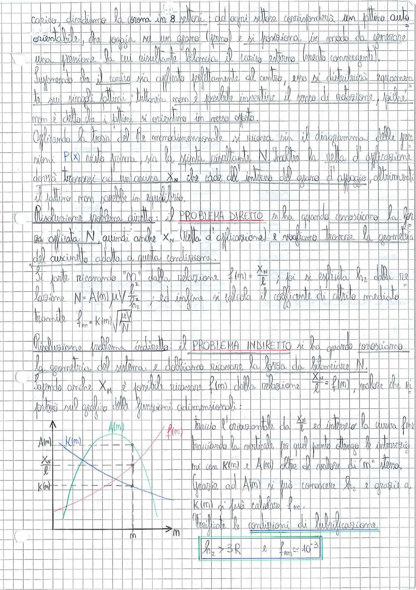

# Page 91 - Cuscinetti: Problema Diretto e Indiretto

corsa, dividiamo la corona in 8 settori; ad ogni settore corrisponderà un pattino auto-orientabile, che poggia su uno spacco (fermo) e si posiziona in modo da generare una pressione la cui risultante bilancia il carico esterno (moto convergente).

Supponendo che il carico sia applicato perfettamente al centro, esso si distribuirà equamente tra i singoli pattini; tuttavia non è possibile impedire il senso di rotazione, poiché non è detto che i pattini si orientino in verso opposto.

Applicando la teoria del $\bar{Pe}$ monodimensionale, si ricava sia il diagramma delle pressioni $P(x)$ nello spessore, sia la spinta risultante $N$. Inoltre la retta di applicazione dovrà trovarsi ad un'ascissa $X_N$ che cade all'interno del organo d'appoggio, altrimenti il pattino non sarebbe in equilibrio.

---

## Risoluzione problema diretto

Il **PROBLEMA DIRETTO** si ha quando conosciamo la forza applicata $N$, quindi anche $X_N$ (retta d'applicazione) e vogliamo trovare la geometria del cuscinetto adatta a questa condizione.

Si parte ricavando "$m$" dalla relazione:

$$f(m) = \frac{X_N}{\ell}$$

poi si esplicita $h_2$ dalla relazione:

$$N = A(m) \cdot \mu V \frac{\ell}{h_2^2}$$

ed infine si calcola il coefficiente di attrito mediato tramite:

$$\boxed{f_m = K(m) \sqrt{\frac{\mu V}{N}}}$$

---

## Risoluzione problema indiretto

Il **PROBLEMA INDIRETTO** si ha quando conosciamo la geometria del sistema e dobbiamo ricavare la forza da bilanciare $N$.

Sapendo anche $X_N$ è possibile ricavare $f(m)$ dalla relazione $\frac{X_N}{\ell} = f(m)$, notare che si porterà sul grafico delle funzioni adimensionali:

> 
> Diagramma: Grafico delle funzioni adimensionali $A(m)$, $K(m)$ e $f(m)$ in funzione di $m$. La curva $f(m)$ (in rosso) viene intersecata tracciando l'orizzontale da $\frac{X_N}{\ell}$, poi la verticale per quel punto fornisce le intersezioni con $K(m)$ e $A(m)$, oltre al valore di $m$ stesso.

Traccio l'orizzontale da $\frac{X_N}{\ell}$ ed interseco la curva $f(m)$. Individuando la verticale per quel punto ottengo le intersezioni con $K(m)$ e $A(m)$ oltre al valore di $m$ stesso.

Grazie ad $A(m)$ si può conoscere $h_2$ e grazie a $K(m)$ si può calcolare $f_m$.

---

### Verificate le condizioni di lubrificazione:

$$\boxed{h_2 > 3R \qquad \text{e} \qquad f_m \approx 10^{-3}}$$
