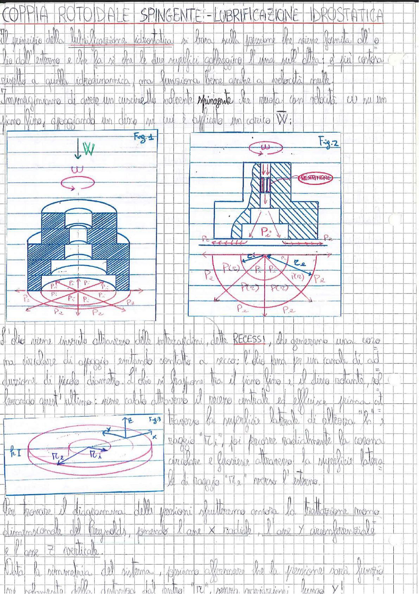

# Page 92 - Coppia Rotoidale Spingente: Lubrificazione Idrostatica

## Coppia Rotoidale Spingente - Lubrificazione Idrostatica

Il principio della lubrificazione idrostatica si basa sulla pressione che viene fornita dall'olio dall'esterno e che fa sì che le due superfici colleggino l'una sull'altra; è più costosa rispetto a quella idrodinamica, ma funziona bene anche a velocità nulle.

Immaginiamo di avere un cuscinetto volvente **spingente** che ruota con velocità $\omega$ su un piano liso, appoggiando su di un disco su cui è applicato un carico $\vec{W}$;

> 
> Diagramma: Fig.1 - Vista laterale e dal basso di un cuscinetto spingente con carico W e velocità angolare ω, con indicazione delle pressioni P₁, P₂, Pₑ nelle varie zone. Fig.2 - Sezione dettagliata del cuscinetto con restrittore, mostrando la distribuzione delle pressioni P(ω), P(z), P(cz) e le zone di recesso con pressioni Pₑ e P₂.

L'olio viene inserito attraverso delle intercapedini, dette **RECESSI**, che generano una zona circolare di appoggio evitando contatto a secco; l'olio passa per un canale di adduzione di piccolo diametro. L'olio si frappone tra il piano liso e il disco rotante, poi lasciando quest'ultimo: viene colato attraverso il recesso centrale ed effluisce prima attraverso la superficie laterale di altezza "$h$" e raggio "$R_1$", poi percorre radialmente la corona circolare e fuorisce attraverso la superficie laterale di raggio "$R_2$" verso l'esterno.

> 
> Diagramma: Fig.3 - Vista assonometrica del cuscinetto con indicazione degli assi X, Y, Z, dei raggi R₁ e R₂, e dell'altezza h₁ del meato.

Per trovare il diagramma delle pressioni sfrutteremo ancora la trattazione mono-dimensionale del Reynolds, ponendo l'asse $x$ radiale, l'asse $y$ circonferenziale e l'asse $z$ verticale.

Data la simmetria del sistema, possiamo affermare che la pressione sarà funzione del solo raggio dalla distanza dal centro "$R$", senza variazioni lungo $y$ e
