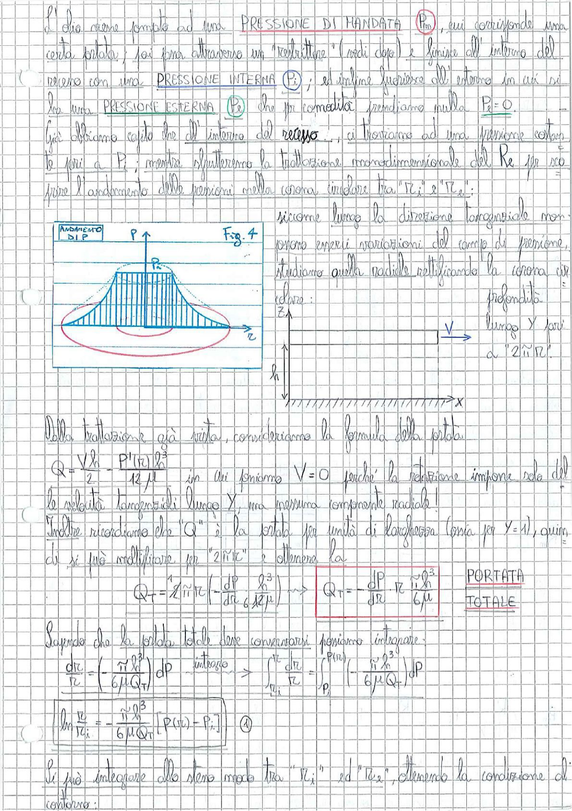

# Page 93 - Pressione nella corona circolare (cuscinetto idrostatico)

L'olio viene pompato ad una **PRESSIONE DI MANDATA** ($P_m$), cui corrisponde una certa portata; poi passa attraverso un "restrittore" (vedi dopo) e finisce all'interno del recesso con una **PRESSIONE INTERNA** ($P_i$); ed infine fuoriesce all'esterno in cui si ha una **PRESSIONE ESTERNA** ($P_e$) che per comodità prendiamo nulla: $P_e = 0$.

Già abbiamo capito che all'interno del recesso..., ci troviamo ad una pressione costante pari a $P_i$; mentre sfrutteremo la trattazione monodimensionale del Re per scoprire l'andamento delle pressioni nella corona circolare tra "$r_i$" e "$r_e$":

> 
> Diagramma: Fig. 4 - Andamento di P: distribuzione di pressione parabolica nella corona circolare del cuscinetto idrostatico, con pressione massima al raggio interno che decresce fino a zero al raggio esterno.

siccome lungo la direzione tangenziale non possono esserci variazioni del campo di pressione, studiamo quella radiale rettificando la corona circolare:

> 
> Diagramma: Sezione rettificata della corona circolare con asse Z verticale e asse X orizzontale, altezza $h$ del meato, con velocità V lungo Y pari a "$2\pi r$". Profondità lungo Y pari a "$2\hat{n}r$".

Della trattazione già vista, consideriamo la formula della portata.

$$Q = \frac{Vh}{2} - \frac{P'(r) h^3}{12\mu}$$

in cui poniamo $V = 0$ perché la rotazione impone solo la velocità tangenziale lungo Y, ma nessuna componente radiale!

Inoltre ricordiamo che "$Q$" è la portata per unità di larghezza (cioè per $Y = 1$), quindi si può moltiplicare per "$2\hat{n}r$" e ottenere la:

$$Q_T = 2\hat{n}r \cdot \left(-\frac{dP}{dr} \cdot \frac{h^3}{12\mu}\right) \longrightarrow \boxed{Q_T = -\frac{dP}{dr} \cdot \frac{\pi r h^3}{6\mu}} \quad \text{PORTATA TOTALE}$$

Sapendo che la portata totale deve conservarsi possiamo integrare:

$$\frac{dr}{r} = \left(-\frac{\pi h^3}{6\mu Q_T}\right) dP \xrightarrow{\text{integro}} \int_{r_i}^{r} \frac{dr}{r} = \int_{P_i}^{P(r)} \left(-\frac{\pi h^3}{6\mu Q_T}\right) dP$$

$$\boxed{\ln\frac{r}{r_i} = -\frac{\pi h^3}{6\mu Q_T} \left[P(r) - P_i\right]} \quad \textcircled{1}$$

Si può integrare allo stesso modo tra "$r_i$" ed "$r_e$", ottenendo la condizione di contorno:
