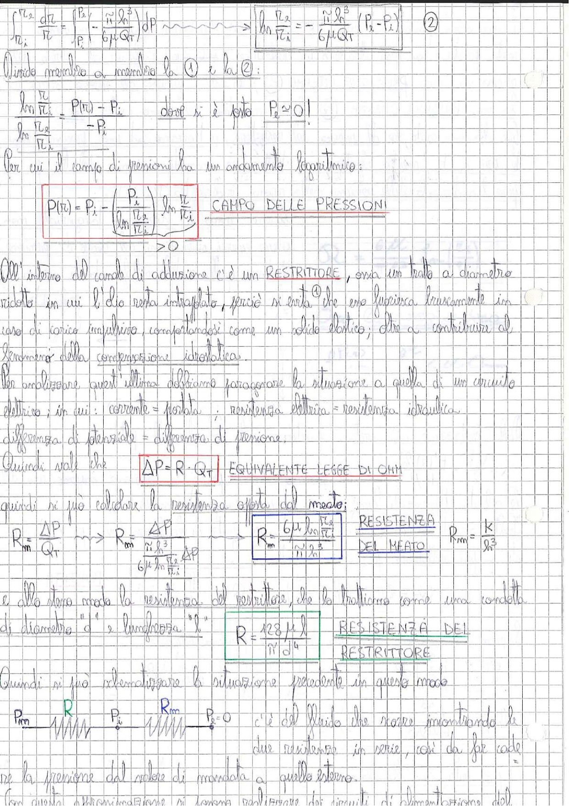

# Page 94 - Campo delle Pressioni e Resistenza Idraulica

$$\int_{r_i}^{r_2} \frac{dr}{r} = \int_{P_1}^{P_2} \left( -\frac{\pi h^3}{6\mu Q_T} \right) dP \quad \longrightarrow \quad \boxed{\ln\frac{r_2}{r_i} = -\frac{\pi h^3}{6\mu Q_T}(P_2 - P_i)} \quad \text{②}$$

Divido membro a membro la ① e la ②:

$$\frac{\ln\frac{r}{r_i}}{\ln\frac{r_2}{r_i}} = \frac{P(r) - P_i}{-P_i} \qquad \text{dove si è posto } P_2 \simeq 0!$$

Per cui il campo di pressioni ha un andamento logaritmico:

$$\boxed{P(r) = P_i - \left(\frac{P_i}{\ln\frac{r_2}{r_i}}\right) \ln\frac{r}{r_i}} \quad \text{CAMPO DELLE PRESSIONI}$$

$$\underbrace{\qquad}_{> 0}$$

All'interno del canale di adduzione c'è un **RESTRITTORE**, ossia un tratto a diametro ridotto in cui il olio resta intrappolato, perciò si evita che esso fuoriesca bruscamente in caso di carico impulsivo, comportandosi come un solido elastico; oltre a contribuire al fenomeno della compensazione idrostatica.

Per analizzare quest'ultima dobbiamo paragonare la situazione a quella di un circuito elettrico; in cui: corrente = portata, resistenza elettrica = resistenza idraulica, differenza di potenziale = differenza di pressione.

Quindi vale che:

$$\boxed{\Delta P = R \cdot Q_T} \quad \text{EQUIVALENTE LEGGE DI OHM}$$

quindi si può calcolare la resistenza offerta dal meato:

$$R_m = \frac{\Delta P}{Q_T} \quad \longrightarrow \quad R_m = \frac{\Delta P}{\frac{\pi h^3}{6\mu \ln\frac{r_2}{r_i}} \Delta P} \quad \longrightarrow \quad \boxed{R_m = \frac{6\mu \ln\frac{r_2}{r_i}}{\pi h^3}} \quad \text{RESISTENZA DEL MEATO} \qquad R_m = \frac{k}{h^3}$$

e allo stesso modo la resistenza del restrittore, che lo trattiamo come una condotta di diametro "$d$" e lunghezza "$l$":

$$\boxed{R = \frac{128 \mu \, l}{\pi d^4}} \quad \text{RESISTENZA DEL RESTRITTORE}$$

Quindi si può schematizzare la situazione precedente in questo modo:

> 
> Diagramma: schema circuitale equivalente con pressione di mandata $P_m$, resistenza del restrittore $R$, pressione intermedia $P_i$, resistenza del meato $R_m$, e pressione esterna $P_e = 0$. Le due resistenze sono in serie.

C'è del fluido che scorre incontrando le due resistenze in serie, così da far cadere la pressione dal valore di mandata a quello esterno.

Con questa schematizzazione si possono realizzare dei circuiti di alimentazione del...
