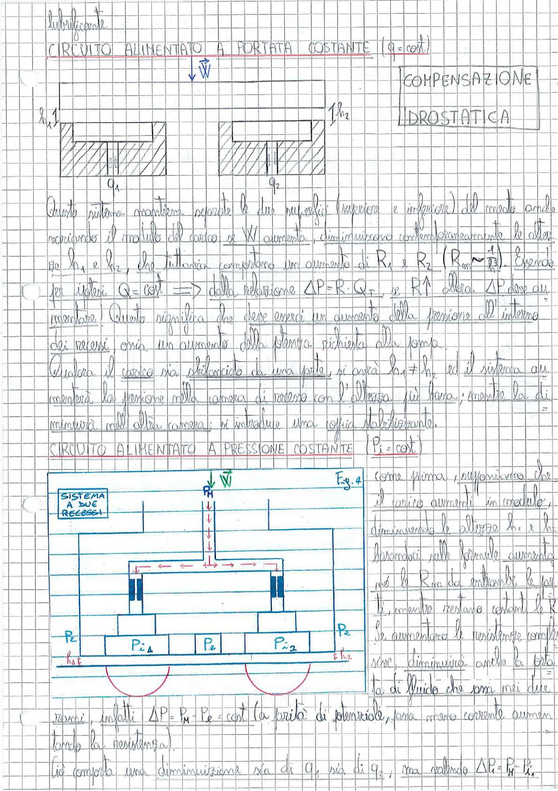

# Page 95 - Compensazione Idrostatica (Lubrificante)

## CIRCUITO ALIMENTATO A PORTATA COSTANTE ($Q = \text{cost}$)

> 
> Diagramma: Schema di cuscinetto idrostatico a due recessi con carico W applicato, altezze h₁ e h₂ e portate Q₁ e Q₂

Questo sistema mantiene separate le due superfici (superiore e inferiore) del moto anche variando il modulo del carico: se $W$ aumenta, diminuiscono contemporaneamente le altezze $h_1$ e $h_2$, che tuttavia comportano un aumento di $R_1$ e $R_2$ ($R_m \sim \frac{1}{h^3}$). Essendo

$$\text{per ipotesi } Q = \text{cost} \implies \text{dalla relazione } \Delta P = R \cdot Q, \text{ se } R \uparrow \text{ allora } \Delta P \text{ deve aumentare.}$$

Questo significa che deve esserci un aumento della pressione all'interno dei recessi, ossia un aumento della potenza richiesta alla pompa.

Qualora il carico sia sbilanciato da una parte, si avrà $h_1 \neq h_2$ ed il sistema aumenterà la pressione nella camera di recesso con l'altezza più bassa; mentre la diminuirà nell'altra camera: si introduce una coppia stabilizzante.

---

## CIRCUITO ALIMENTATO A PRESSIONE COSTANTE ($P_i = \text{cost}$)

> 
> Diagramma: Schema di sistema a due recessi alimentato a pressione costante (Fig. 4), con pressioni $P_2$, $P_{r1}$, $P_e$, $P_{r2}$, $P_2$ indicate sotto il cuscinetto, altezze $h_1$ e $h_2$, e carico $\vec{W}$ applicato

Come prima, supponiamo che il carico aumenti in modulo, diminuendo le altezze $h_1$ e $h_2$. Basandoci sulle formule, aumentano le $R_m$ da entrambe le parti, mentre restano costanti le $R_i$.

Se aumentano le resistenze complessive, diminuirà anche la portata di fluido che passa nei due rami, infatti $\Delta P = P_M - P_e = \text{cost}$ (a parità di potenziale), ora meno corrente aumentando la resistenza).

Ciò comporta una diminuzione sia di $Q_1$ sia di $Q_2$, ma valerà $\Delta P_i = P_i - P_i$.
