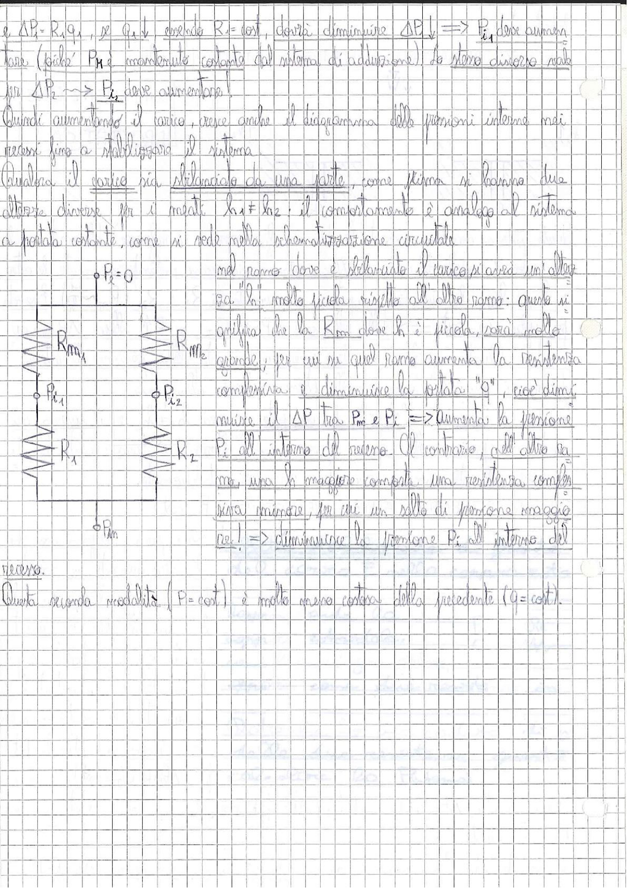

# Page 96 - Regolazione pressione: sistema a portata costante (cont.)

e $\Delta P_2 = R_2 q_1$, se $q_1 \downarrow$, essendo $R_2 = \text{cost}$, dovrà diminuire $\Delta P_1 \downarrow \Rightarrow P_{i_1}$ deve aumentare (già che $P_M$ è mantenuta costante dal sistema di adduzione); lo stesso discorso vale per $\Delta P_2 \longrightarrow P_{i_2}$ deve aumentare!

Quindi aumentando il carico, cresce anche il diagramma delle pressioni interne nei recessi fino a stabilizzare il sistema.

Qualora il carico sia sbilanciato da una parte, come prima si hanno due altezze diverse fra i meati $h_1 \neq h_2$: il comportamento è analogo al sistema a portata costante, come si vede nella schematizzazione circuitale

> 
> Diagramma: Schema circuitale idraulico con due rami in parallelo. Il ramo sinistro contiene la resistenza $R_{m_1}$ (meato) e la resistenza $R_1$ (recesso), con punti $P_2 = 0$ e $P_{i_1}$. Il ramo destro contiene la resistenza $R_{m_2}$ (meato) e la resistenza $R_2$ (recesso), con punti $P_{i_2}$. In basso il punto $P_M$ comune di alimentazione.

nel ramo dove è sbilanciato il carico piazzò un'altezza "$h$" molto piccola rispetto all'altro ramo: questo significa che la $R_m$ dove $h$ è piccola, sarà molto grande, per cui su quel ramo aumenta la resistenza complessiva e diminuisce la portata "$Q$", cioè diminuisce il $\Delta P$ tra $P_M$ e $P_i \Rightarrow$ aumenta la pressione $P_i$ all'interno del recesso. Al contrario, nell'altro ramo, una $h$ maggiore comporta una resistenza, complessiva minore, per cui un salto di pressione maggiore nel $\downarrow \Rightarrow$ diminuisce la pressione $P_i$ all'interno del recesso.

Questa seconda modalità ($P_i = \text{cost}$) è molto meno costosa della precedente ($q = \text{cost}$).
