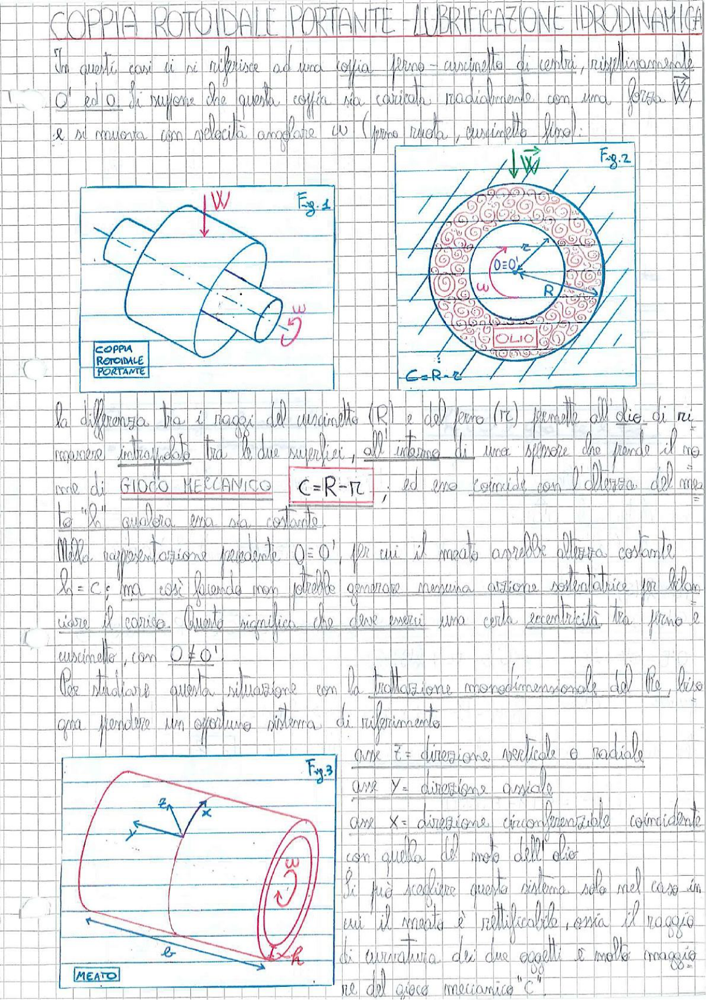

# Page 97 - Coppia Rotoidale Portante - Lubrificazione Idrodinamica

In questi casi ci si riferisce ad una coppia perno-cuscinetto di centri, rispettivamente, $O'$ ed $O$. Si suppone che questa coppia sia caricata radialmente con una forza $\vec{W}$, e si muova con velocità angolare $\omega$ (perno ruota, cuscinetto fiso).

> 
> Diagramma: Fig.1 - Vista assonometrica della coppia rotoidale portante con perno cilindrico caricato con forza W e rotante con velocità angolare ω

> 
> Diagramma: Fig.2 - Sezione trasversale della coppia rotoidale portante, vista frontale con cuscinetto di raggio R, perno di raggio r, centri O e O', velocità angolare ω, e strato di olio. Gioco meccanico C = R - r

La differenza tra i raggi del cuscinetto ($R$) e del perno ($r_c$) permette all'olio di rimanere intrappolato tra le due superfici, all'interno di una sfilatura che prende il nome di **GIOCO MECCANICO**

$$\boxed{C = R - r}$$

ed esso coincide con l'altezza del meato "$h$" qualora esso sia costante.

Nella rappresentazione precedente $O \equiv O'$, per cui il meato avrebbe altezza costante $h = C$; ma così facendo non potrebbe generare nessuna azione sollevatrice per bilanciare il carico. Questo significa che deve esserci una certa eccentricità tra perno e cuscinetto, con $O \neq O'$.

Per studiare questa situazione con la trattazione monodimensionale del Re, bisogna prendere un opportuno sistema di riferimento:

- asse $z$ = direzione verticale o radiale
- asse $y$ = direzione assiale
- asse $x$ = direzione circonferenziale coincidente con quella del moto dell'olio

> 
> Diagramma: Fig.3 - Vista assonometrica del meato rettificato con sistema di riferimento (x, y, z), dimensioni b (larghezza assiale) e h (altezza del meato), con velocità angolare ω

Si può adottare questo sistema solo nel caso in cui il meato è rettificabile, ossia il raggio di curvatura dei due oggetti è molto maggiore del gioco meccanico "$C$".
