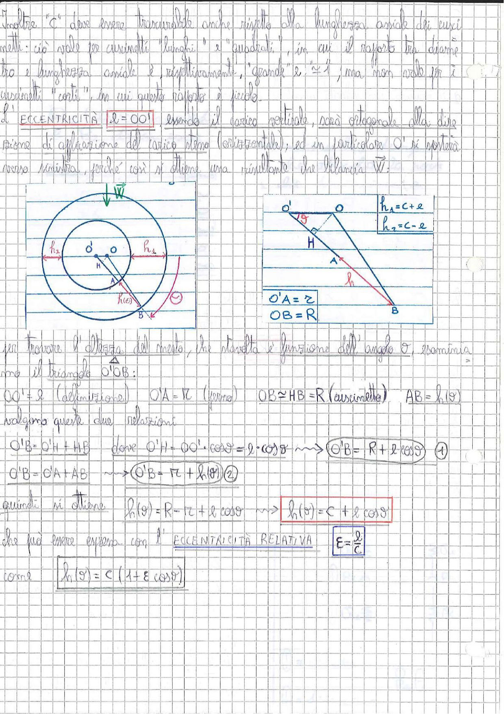

# Page 98 - Cuscinetti: Eccentricità e Altezza del Meato

Inoltre "c" deve essere trascurabile anche rispetto alla lunghezza assiale dei cuscinetti: ciò vale per cuscinetti "lunghi" e "quadrati", in cui il rapporto tra diametro e lunghezza assiale è, rispettivamente, "grande" è $\simeq 1$, ma non vale per i cuscinetti "corti", in cui questo rapporto è piccolo.

L'**ECCENTRICITÀ** $\boxed{e = OO'}$ essendo il carico verticale, sarà ortogonale alla direzione di applicazione del carico stesso (orizzontale), ed in particolare $O'$ si sposterà verso sinistra, perché così si ottiene una risultante che bilancia $\vec{W}$:

> 
> Diagramma: Schema del cuscinetto con cerchi concentrici (perno e cuscinetto) visti frontalmente, con indicazione dell'eccentricità $e$, del peso $\vec{W}$, dei punti $O$, $O'$, $H$, $A$, $B$ e delle distanze $h_1$, $h_2$, $h(\vartheta)$. A destra, il triangolo geometrico $O'OB$ con le relazioni $h_1 = c + e$, $h_2 = c - e$, $O'A = r$, $OB = R$.

Per trovare l'altezza del meato, che risulta è funzione dell'angolo $\vartheta$, esaminiamo il triangolo $O'OB$:

$$OO' = e \quad (\text{definizione}) \qquad O'A = r \quad (\text{perno}) \qquad OB \simeq HB = R \quad (\text{cuscinetto}) \qquad AB = h(\vartheta)$$

Valgono queste due relazioni:

$$O'B = O'H + HB \quad \text{dove} \quad O'H = OO' \cdot \cos\vartheta = e \cdot \cos\vartheta \quad \longrightarrow \quad \boxed{O'B = R + e\cos\vartheta} \quad (1)$$

$$O'B = O'A + AB \quad \longrightarrow \quad \boxed{O'B = r + h(\vartheta)} \quad (2)$$

Quindi si ottiene:

$$h(\vartheta) = R - r + e\cos\vartheta \quad \longrightarrow \quad \boxed{h(\vartheta) = c + e\cos\vartheta}$$

che può essere espressa con l'**ECCENTRICITÀ RELATIVA**:

$$\boxed{\varepsilon = \frac{e}{c}}$$

come:

$$\boxed{h(\vartheta) = c\left(1 + \varepsilon\cos\vartheta\right)}$$
