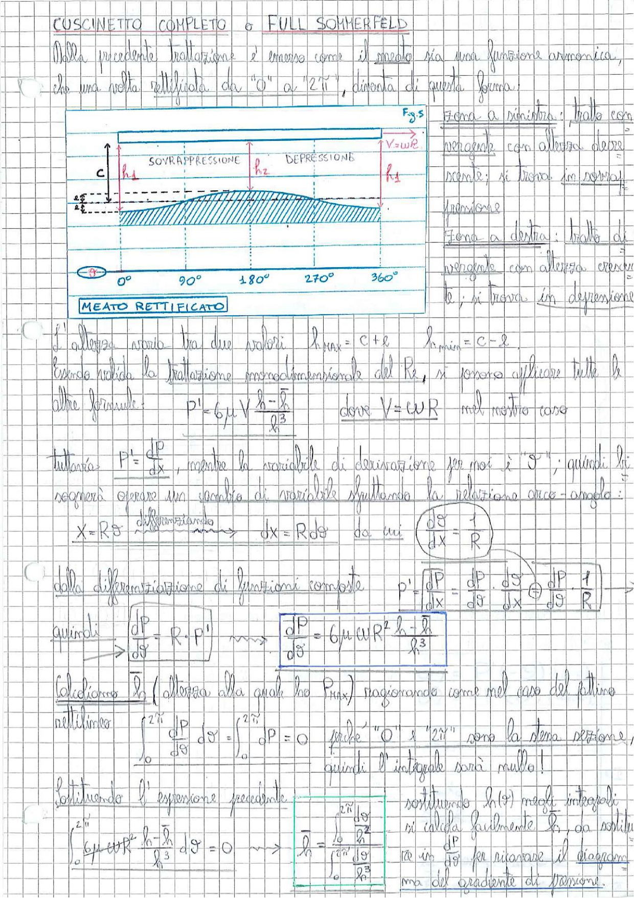

# Page 99 - Cuscinetto Completo o Full Sommerfeld

## CUSCINETTO COMPLETO o FULL SOMMERFELD

Dalla precedente trattazione è emerso come il meato sia una funzione armonica, che una volta "rettificata" da "0" a "$2\pi$", diventa di questa forma:

> 
> Diagramma: Meato rettificato del cuscinetto completo. Si mostra l'andamento dell'altezza del meato $h$ in funzione dell'angolo $\vartheta$ da $0°$ a $360°$. Il profilo è sinusoidale con zona di sovrappressione (a sinistra, altezza decrescente) e zona di depressione (a destra, altezza crescente). La velocità $V = \omega R$ è indicata sulla superficie superiore. L'altezza media è $C$, con scostamenti $\pm e$.

**Fig. 9.5**

- **Zona a sinistra:** tratto con pendenza con altezza decrescente; si trova in sovrapressione
- **Zona a destra:** tratto di pendenza con altezza crescente; si trova in depressione

### MEATO RETTIFICATO

L'altezza varia tra due valori:

$$h_{max} = C + e \qquad h_{min} = C - e$$

Essendo valida la trattazione monodimensionale del Re, si possono applicare tutte le altre formule:

$$p' = 6\mu V \frac{h - \bar{h}}{h^3} \qquad \text{dove } V = \omega R \text{ nel nostro caso}$$

Tuttavia $p' = \frac{dp}{dx}$, mentre la variabile di derivazione per noi è "$\vartheta$"; quindi bisognerà operare un cambio di variabile sfruttando la relazione arco-angolo:

$$x = R\vartheta \xrightarrow{\text{differenziando}} dx = R\,d\vartheta \qquad \text{da cui} \quad \boxed{\frac{d\vartheta}{dx} = \frac{1}{R}}$$

Dalla differenziazione di funzioni composte:

$$p' = \frac{dP}{dx} = \frac{dP}{d\vartheta} \cdot \frac{d\vartheta}{dx} = \frac{dP}{d\vartheta} \cdot \frac{1}{R}$$

quindi:

$$\frac{dP}{d\vartheta} = R \cdot p'$$

$$\boxed{\frac{dP}{d\vartheta} = 6\mu\,\omega\,R^2 \frac{h - \bar{h}}{h^3}}$$

### Calcolo di $\bar{h}$

Calcoliamo $\bar{h}$ (altezza alla quale ho $P_{max}$) ragionando come nel caso del pattino rettilineo:

$$\int_0^{2\pi} \frac{dP}{d\vartheta}\,d\vartheta = \left. P \right|_0^{2\pi} = \Delta P = 0 \qquad \text{perché "0" e "} 2\pi \text{" sono la stessa sezione,}$$

$$\text{quindi l'integrale sarà nullo!}$$

Sostituendo l'espressione precedente:

$$\int_0^{2\pi} 6\mu\,\omega\,R^2 \frac{h - \bar{h}}{h^3}\,d\vartheta = 0$$

$$\Longrightarrow \quad \bar{h} = \frac{\int_0^{2\pi} \frac{1}{h^2}\,d\vartheta}{\int_0^{2\pi} \frac{1}{h^3}\,d\vartheta}$$

Sostituendo $h(\vartheta)$ negli integrali si calcola facilmente $\bar{h}$, da sostituire in $\frac{dP}{d\vartheta}$ per ricavare il diagramma del gradiente di pressione.
