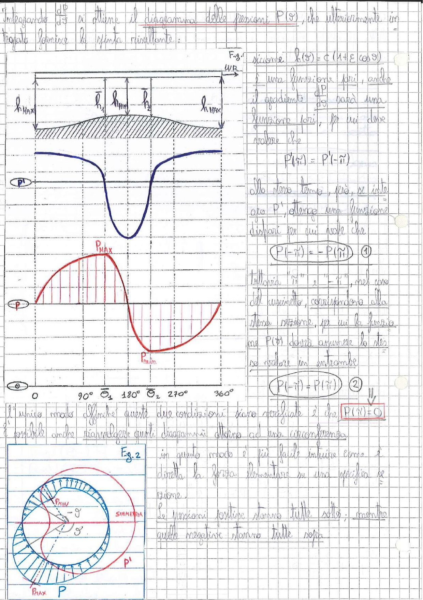

# Page 100 - Diagramma delle pressioni nel cuscinetto

Integrando $\frac{dP}{d\vartheta}$ si ottiene il diagramma delle pressioni $P(\vartheta)$, che ulteriormente integrato fornisce la spinta risultante:

> 
> Diagramma: Fig. 1 - Distribuzione dello spessore del meato $h(\vartheta)$ con profilo parabolico (in blu) che va da $h_{MAX}$ ai lati fino a $h_{MIN}$ al centro; sotto, diagramma della pressione P (in rosso) con andamento sinusoidale che va da $P_{MAX}$ a $P_{min}$; asse $\vartheta$ da $0°$ a $360°$ con punti notevoli $90°$, $\bar{\vartheta}_1$, $180°$, $\bar{\vartheta}_2$, $270°$.

Siccome $h(\vartheta) = c(1 + \varepsilon \cos \vartheta)$ è una funzione pari, anche il gradiente $\frac{dP}{d\vartheta}$ sarà una funzione pari, per cui deve valere che:

$$P(\tilde{n}) = P'(-\tilde{n})$$

Allo stesso tempo, più, se integro ora $P'$, ottengo una funzione dispari per cui vale che:

$$\boxed{P(-\tilde{n}) = -P(\tilde{n})} \quad (1)$$

Tuttavia "$\tilde{n}$" e "$-\tilde{n}$", nel caso del cuscinetto, corrispondono alla stessa sezione, per cui la pressione $P(\vartheta)$ dovrà assumere lo stesso valore in entrambe:

$$\boxed{P(-\tilde{n}) = P(\tilde{n})} \quad (2)$$

L'unico modo affinché queste due condizioni siano verificate è che $\boxed{P(\tilde{n}) = 0}$

È possibile anche riavvolgere questi diagrammi attorno ad una circonferenza.

> 
> Diagramma: Fig. 2 - Rappresentazione polare delle pressioni nel cuscinetto: diagramma circolare con la distribuzione di pressione $P$ (in rosso) e $P'$ (in blu) riavvolte attorno alla sezione del cuscinetto, con indicazione di $P_{MAX}$, $P_{MIN}$, angolo $\vartheta'$, $-\vartheta'$ e asse di simmetria.

In questo modo è più facile intuire come è diretta la forza elementare su una specifica sezione.

Le pressioni positive stanno tutte sotto, mentre quelle negative stanno tutte sopra.
