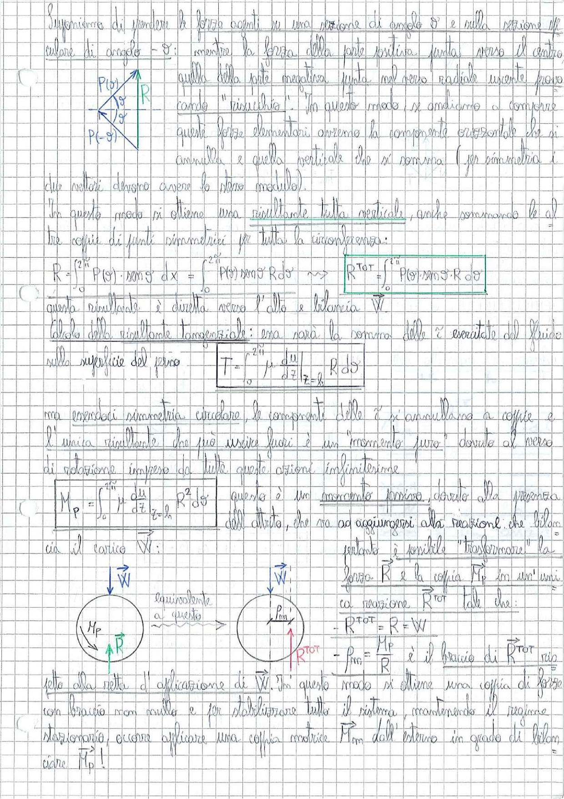

# Page 101 - Risultante delle forze su perno (cuscinetto portante)

Supponiamo di prendere le forze agenti su una sezione di angolo $\vartheta$ e sulla sezione affacciata di angolo $-\vartheta$: mentre la forza della parte positiva punta verso il centro, quella della parte negativa punta nel verso radiale uscente producendo "risucchio". In questo modo, se andiamo a comporre queste forze elementari avremo la componente orizzontale che si annulla, e quella verticale che si somma (per simmetria i due vettori devono avere lo stesso modulo).

> 
> Diagramma: Schema vettoriale delle forze $P(\vartheta)$ e $P(-\vartheta)$ su una sezione del perno con risultante $R$ verticale

In questo modo si ottiene una risultante tutta verticale, anche sommando le altre coppie di punti simmetrici per tutta la circonferenza:

$$R = \int_0^{2\pi} P(\vartheta) \cdot \sin\vartheta \, dx = \int_0^{2\pi} P(\vartheta) \sin\vartheta \, R \, d\vartheta \quad \Longrightarrow \quad \boxed{R^{TOT} = \int_0^{2\pi} P(\vartheta) \sin\vartheta \cdot R \, d\vartheta}$$

Questa risultante è diretta verso l'alto e bilancia $\vec{W}$.

**Calcolo della risultante tangenziale:** essa sarà la somma delle $\vec{\tau}$ esercitate dal fluido sulla superficie del perno:

$$\boxed{T = \int_0^{2\pi} \mu \left. \frac{du}{dz} \right|_{z=h} R \, d\vartheta}$$

Ma essendoci simmetria circolare, le componenti delle $\vec{\tau}$ si annullano a coppie e l'unica risultante che può uscire fuori è un "momento puro" dovuto al verso di rotazione impresso da tutte queste azioni infinitesime.

$$\boxed{M_P = \int_0^{2\pi} \mu \left. \frac{du}{dz} \right|_{z=h} R^2 \, d\vartheta}$$

Questo è un **momento torsivo**, dovuto alla presenza dell'attrito, che va ad aggiungersi alla reazione che bilancia il carico $\vec{W}$:

> 
> Diagramma: Equivalenza tra il sistema (forza $R$ + momento $M_P$ + carico $W$) e il sistema con reazione unica $R^{TOT}$ applicata con braccio $\rho_m$ rispetto all'asse del perno

Pertanto è possibile "trasformare" la forza $R$ e la coppia $M_P$ in un'unica reazione $\vec{R}^{TOT}$ tale che:

$$- R^{TOT} = R = W$$

$$- \rho_m = \frac{M_P}{R}$$

è il braccio di $\vec{R}^{TOT}$ rispetto alla retta d'applicazione di $\vec{W}$. In questo modo si ottiene una coppia di forze con braccio non nullo e per stabilizzare tutto il sistema, mantenendo il regime stazionario, occorre applicare una coppia motrice $M_m$ dall'esterno in grado di bilanciare $M_P$!
