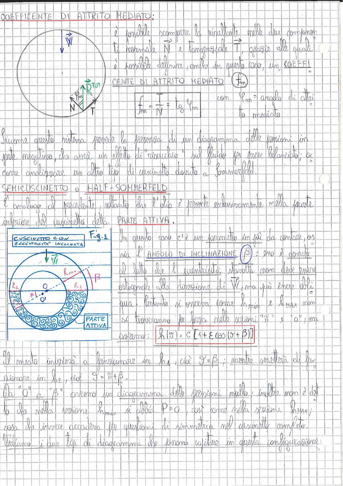

# Page 102 - Coefficiente di Attrito Mediato e Semicuscinetto di Half-Sommerfeld

## COEFFICIENTE DI ATTRITO MEDIATO:

È possibile scomporre la risultante nelle due componenti, la normale $\vec{N}$ e tangenziale $\vec{T}$, grazie alle quali è possibile definire, anche in questo caso, un **COEFFICIENTE DI ATTRITO MEDIATO** ($f_m$):

$$\boxed{f_m = \frac{T}{N} = \frac{T}{W} = \tan \varphi_m}$$

con $\varphi_m$ = angolo di attrito mediato.

> 
> Diagramma: Schema di scomposizione della risultante $\vec{R}_{TOT}$ nelle componenti normale $\vec{N}$ e tangenziale $\vec{T}$ sul cuscinetto, con il carico $\vec{W}$ applicato verticalmente e l'angolo di attrito mediato $\varphi_m$ indicato.

---

Siccome questo sistema prevede la presenza di un diagramma delle pressioni in parte negativo, che avrà un effetto di "risucchio" sul fluido per essere bilanciato; ci corre analizzare un altro tipo di cuscinetto dovuto a Sommerfeld.

## SEMICUSCINETTO o HALF-SOMMERFELD

È analogo al precedente, soltanto che l'olio è presente esclusivamente nella parte inferiore del cuscinetto detta **PARTE ATTIVA**.

In questo caso c'è un parametro in più da contare, ossia l'**ANGOLO DI INCLINAZIONE** ($\beta$): esso è dovuto al fatto che l'eccentricità stavolta non deve essere ortogonale alla direzione di $\vec{W}$, ma può essere obliqua. Pertanto si osserva come $h_{min}$ e $h_{MAX}$ non si troveranno per forza nelle sezioni "$\hat{n}$" e "$O$", ma avremo:

$$\boxed{h(\vartheta) = C \left[1 + \varepsilon \cos(\vartheta + \beta)\right]}$$

> 
> Diagramma: Cuscinetto con eccentricità inclinata (Fig. 1). Si mostra la sezione del cuscinetto con il centro $O$ del cuscinetto e il centro $O'$ dell'albero, l'angolo $\beta$ di inclinazione dell'eccentricità, le quote $h_1$, $h_2$ e la parte attiva evidenziata nella metà inferiore.

---

Il meato inizierà a funzionare in $h_1$, cioè $\vartheta = \beta$; mentre smetterà di funzionare in $h_2$, cioè $\vartheta = \pi + \beta$.

Da "$O$" a "$\beta$" avremo un diagramma delle pressioni nullo; inoltre non è detto che nella sezione $h_{min}$ si abbia $P = 0$, così come nella sezione $h_{MAX}$; cosa che invece accadeva per questioni di simmetria nel cuscinetto completo.

Vediamo i due tipi di diagrammi che posso capitare in questa configurazione:
