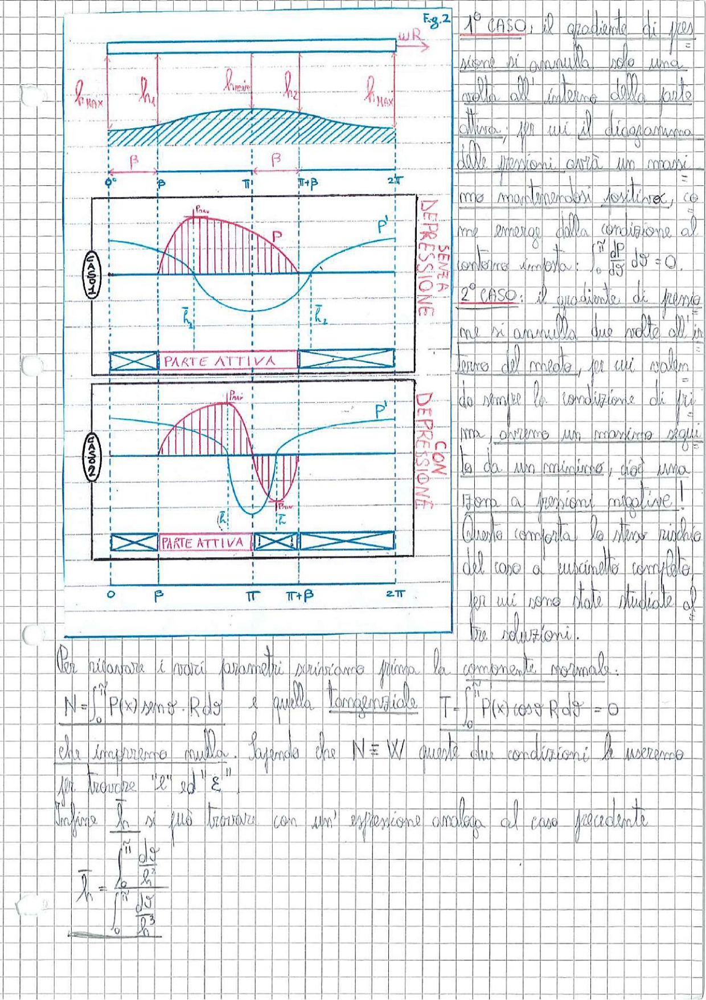

# Page 103 - Cuscinetti idrodinamici: distribuzione di pressione (casi)

## Fig. 2 - Distribuzione dello spessore del meato e diagrammi di pressione

> 
> Diagramma: Figura 2 con tre grafici sovrapposti. In alto: andamento dello spessore del meato $h$ tra $0$ e $2\pi$, con indicazione di $h_{MAX}$, $h_1$, $h_{min}$, $h_2$, $h_{MAX}$ e la velocità $\omega R$. La zona tratteggiata rappresenta il meato convergente-divergente. Al centro (Caso 1): diagramma delle pressioni senza depressione, con $p_{MAX}$ e zona attiva (parte attiva) tra $\beta$ e $\pi + \beta$, pressione sempre positiva. In basso (Caso 2): diagramma delle pressioni con depressione, con $p_{MAX}$ e $p_{MIN}$ (pressione negativa), zona attiva ridotta.

---

**1° CASO:** il gradiente di pressione si annulla solo una volta all'interno della parte attiva; per cui il diagramma delle pressioni avrà un massimo ma manterrà pressioni positive, come emerge dalla condizione al contorno imposta:

$$\int_0^{\pi} \frac{dp}{d\vartheta} \, d\vartheta = 0$$

**2° CASO:** il gradiente di pressione si annulla due volte all'interno del meato, per cui volendo rendere la condizione di prima, avremo un massimo seguito da un minimo, cioè una zona a pressioni negative!

Questo comporta lo stesso rischio del caso a cuscinetto completo, per cui sono state studiate altre soluzioni.

---

## Calcolo dei parametri

Per ricavare i vari parametri scriviamo prima la **componente normale**:

$$N = \int_0^{\pi} P(\vartheta) \sin\vartheta \cdot R \, d\vartheta$$

e quella **tangenziale**:

$$T = \int_0^{\pi} P(\vartheta) \cos\vartheta \cdot R \, d\vartheta = 0$$

che imporremo nulla. Sapendo che $N \equiv W$, queste due condizioni le useremo per trovare "$e$" ed "$\varepsilon$".

Infine $\bar{h}$ si può trovare con un'espressione analoga al caso precedente:

$$\boxed{\bar{h} = \frac{\int_0^{\pi} \frac{d\vartheta}{h^2}}{\int_0^{\pi} \frac{d\vartheta}{h^3}}}$$
