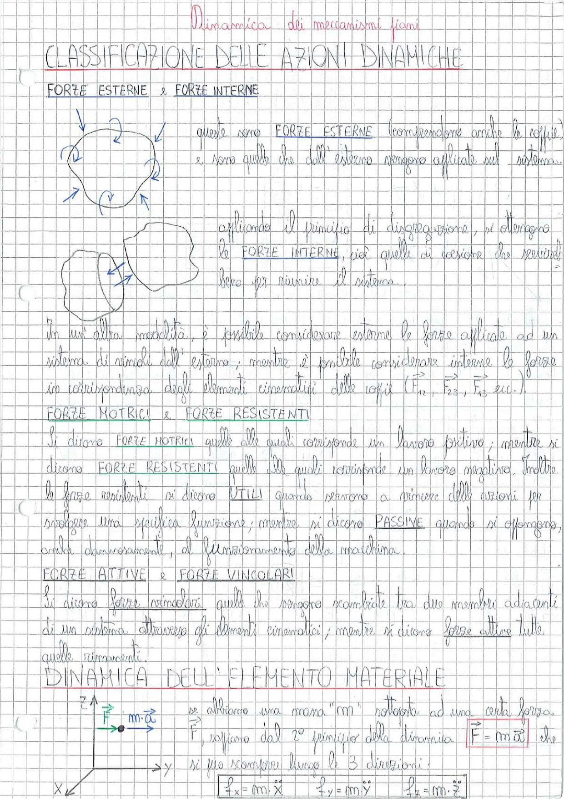

# Page 105 - Dinamica dei Meccanismi Piani: Classificazione delle Azioni Dinamiche

## Dinamica dei meccanismi piani

## CLASSIFICAZIONE DELLE AZIONI DINAMICHE

### FORZE ESTERNE e FORZE INTERNE

> 
> Diagramma: Sistema di corpi vincolati con forze esterne (frecce) applicate, e successiva disaggregazione che mostra le forze interne (reazioni vincolari) tra i corpi separati.

Queste sono **FORZE ESTERNE** (comprendono anche le coppie) e sono quelle che dall'esterno vengono applicate sul sistema.

Applicando il principio di disaggregazione, si ottengono le **FORZE INTERNE**, cioè quelle di coesione che servirebbero per riunire il sistema.

In un'altra modalità, è possibile considerare esterne le forze applicate ad un sistema di vincoli dall'esterno, mentre è possibile considerare interne le forze in corrispondenza degli elementi cinematici delle coppie ($\vec{F}_{12}$, $\vec{F}_{23}$, $\vec{F}_{43}$ ecc.).

### FORZE MOTRICI e FORZE RESISTENTI

Si dicono **FORZE MOTRICI** quelle alle quali corrisponde un lavoro positivo; mentre si dicono **FORZE RESISTENTI** quelle alle quali corrisponde un lavoro negativo. Inoltre le forze resistenti si dicono **UTILI** quando servono a vincere delle azioni per svolgere una specifica funzione; mentre si dicono **PASSIVE** quando si oppongono, anche dannosamente, al funzionamento della macchina.

### FORZE ATTIVE e FORZE VINCOLARI

Si dicono **forze vincolari** quelle che vengono scambiate tra due membri adiacenti di un sistema attraverso gli elementi cinematici; mentre si dicono **forze attive** tutte quelle rimanenti.

## DINAMICA DELL'ELEMENTO MATERIALE

> 
> Diagramma: Elemento materiale (punto) di massa $m$ soggetto a forza $\vec{F}$ con accelerazione $m \cdot \vec{a}$, in un sistema di riferimento cartesiano $xyz$.

Se abbiamo una massa "$m$" sottoposta ad una certa forza $\vec{F}$, sappiamo dal 2° principio della dinamica che:

$$\boxed{\vec{F} = m \cdot \vec{a}}$$

che si può scomporre lungo le 3 direzioni:

$$\boxed{f_x = m \cdot \ddot{x}} \qquad \boxed{f_y = m \cdot \ddot{y}} \qquad \boxed{f_z = m \cdot \ddot{z}}$$
