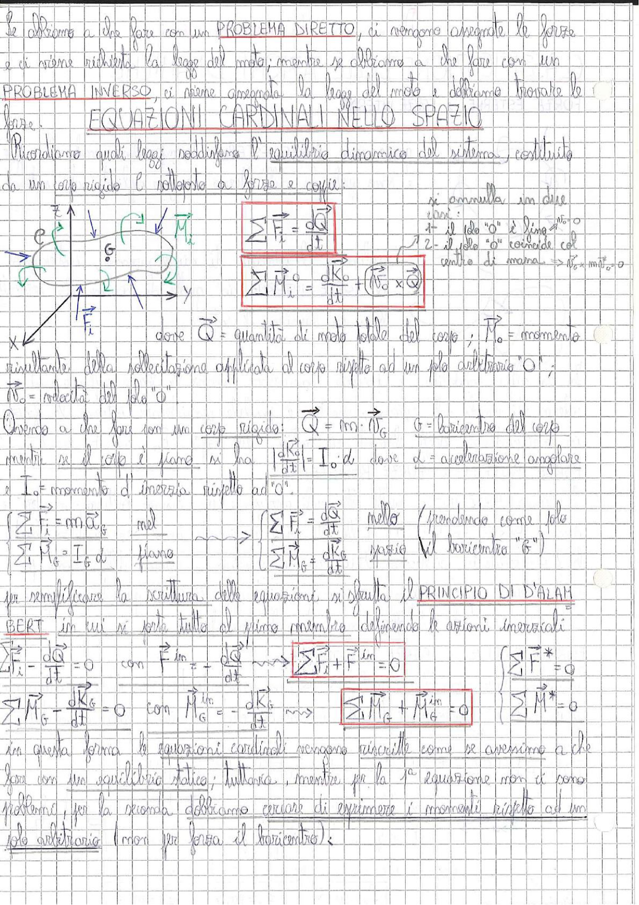

# Page 106 - Equazioni Cardinali nello Spazio / Principio di D'Alembert

Se abbiamo a che fare con un **PROBLEMA DIRETTO**, ci vengono assegnate le forze e ci viene richiesta la legge del moto; mentre se abbiamo a che fare con un **PROBLEMA INVERSO**, ci viene assegnata la legge del moto e dobbiamo trovare le forze.

## EQUAZIONI CARDINALI NELLO SPAZIO

Ricordiamo quali leggi soddisfano l'equilibrio dinamico del sistema, costituito da un corpo rigido e sollecitato a forze e coppie:

> 
> Diagramma: corpo rigido nello spazio con sistema di riferimento (x, y, z), baricentro G, forze esterne $\vec{F}_i$, coppie $\vec{M}$, e polo O indicato. Frecce verdi indicano rotazioni e spostamenti del corpo.

$$\boxed{\sum_i \vec{F}_i = \frac{d\vec{Q}}{dt}}$$

$$\boxed{\sum_i \vec{M}_O = \frac{d\vec{K}_O}{dt} + (\vec{V}_O \times \vec{Q})}$$

Si annulla in due casi:
1. il polo "O" è fisso $\Rightarrow \vec{V}_O = 0$
2. il polo "O" coincide col centro di massa $\Rightarrow \vec{V}_O = m\vec{v}_G \Rightarrow \vec{V}_O \times m\vec{v}_G = 0$

dove $\vec{Q}$ = quantità di moto totale del corpo; $\vec{M}_O$ = momento risultante della sollecitazione applicata al corpo rispetto ad un polo arbitrario "O"; $\vec{V}_O$ = velocità del polo "O".

Avendo a che fare con un corpo rigido: $\vec{Q} = m \cdot \vec{V}_G$ dove G = baricentro del corpo.

Mentre se il corpo è piano si ha $\left|\frac{d\vec{K}_O}{dt}\right| = I_O \cdot \dot{\alpha}$ dove $\dot{\alpha}$ = accelerazione angolare e $I_O$ = momento d'inerzia rispetto ad "O".

$$\begin{cases} \sum_i \vec{F}_i = m\vec{a}_G \\ \sum_i \vec{M}_O = I_O \dot{\alpha} \end{cases} \quad \text{nel piano}$$

$$\begin{cases} \sum_i \vec{F}_i = \frac{d\vec{Q}}{dt} \\ \sum_i \vec{M}_G = \frac{d\vec{K}_G}{dt} \end{cases} \quad \text{nello spazio (prendendo come polo fisso il baricentro "G")}$$

Per semplificare la scrittura delle equazioni, si sfrutta il **PRINCIPIO DI D'ALEMBERT** in cui si porta tutto al primo membro definendo le azioni inerziali:

$$\sum \vec{F}_i - \frac{d\vec{Q}}{dt} = 0 \quad \text{con} \quad \vec{F}_i^{in} = -\frac{d\vec{Q}}{dt}$$

$$\boxed{\sum_i \vec{F}_i + \vec{F}_i^{in} = 0} \qquad \left(\sum \vec{F}^* = 0\right)$$

$$\sum \vec{M}_G - \frac{d\vec{K}_G}{dt} = 0 \quad \text{con} \quad \vec{M}_G^{in} = -\frac{d\vec{K}_G}{dt}$$

$$\boxed{\sum_i \vec{M}_G + \vec{M}_G^{in} = 0} \qquad \left(\sum \vec{M}^* = 0\right)$$

In questa forma le equazioni cardinali vengono riscritte come se avessimo a che fare con un equilibrio statico; tuttavia, mentre per la 1ª equazione non ci sono problemi, per la seconda dobbiamo cercare di esprimere i momenti rispetto ad un polo arbitrario (non per forza il baricentro):
