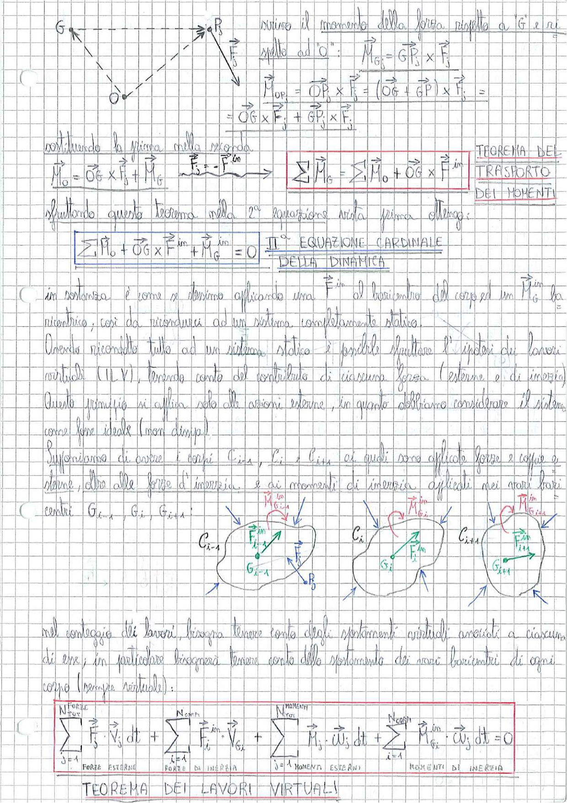

# Page 107 - II Equazione Cardinale della Dinamica e Teorema dei Lavori Virtuali

## Trasporto dei momenti

> 
> Diagramma: Schema di un corpo con polo O e baricentro G, con forza $\vec{F}_j$ applicata in un punto P, per illustrare il trasporto dei momenti.

Scriviamo il momento della forza rispetto a G e rispetto ad O:

$$\vec{M}_{G_j} = \vec{GP}_j \times \vec{F}_j$$

$$\vec{M}_{OP_j} = \vec{OP}_j \times \vec{F}_j = (\vec{OG} + \vec{GP}) \times \vec{F}_j =$$
$$= \vec{OG} \times \vec{F}_j + \vec{GP}_j \times \vec{F}_j$$

Sostituendo la prima nella seconda:

$$\vec{M}_O = \vec{OG} \times \vec{F}_j + \vec{M}_G$$

$$\boxed{\sum \vec{M}_G = \sum \vec{M}_O + \vec{OG} \times \vec{F}^{in}}$$

**TEOREMA DEL TRASPORTO DEI MOMENTI**

## II Equazione Cardinale della Dinamica

Sfruttando questo teorema nella 2ª equazione vista prima ottengo:

$$\boxed{\sum \vec{M}_O + \vec{OG} \times \vec{F}^{in} + \vec{M}_G^{in} = 0}$$

**II° EQUAZIONE CARDINALE DELLA DINAMICA**

(In sostanza è come se stessimo applicando una $\vec{F}^{in}$ al baricentro del corpo ed un $\vec{M}_G^{in}$ la rientrica, così da ricondurci ad un sistema completamente statico.)

## Teorema dei Lavori Virtuali

Avendo ricondotto tutto ad un sistema statico è possibile sfruttare l'ipotesi dei lavori virtuali (ILV), tenendo conto del contributo di ciascuna forza (esterne e di inerzia). Questo principio si applica solo alle azioni esterne, in quanto dobbiamo considerare il sistema come leghe ideale (non dissipa).

Supponiamo di avere i corpi $C_{i-1}$, $C_i$ e $C_{i+1}$ ai quali sono applicate forze e coppie esterne, oltre alle forze d'inerzia e ai momenti di inerzia applicati nei vari loro centri $G_{i-1}$, $G_i$, $G_{i+1}$:

> 
> Diagramma: Tre corpi $C_{i-1}$, $C_i$, $C_{i+1}$ collegati tra loro con i rispettivi baricentri $G_{i-1}$, $G_i$, $G_{i+1}$, su ciascuno dei quali sono indicate le forze d'inerzia $\vec{F}^{in}$ e i momenti d'inerzia $\vec{M}_G^{in}$, oltre alle forze esterne e alla reazione $R_0$.

Nel conteggio dei lavori, bisogna tenere conto degli spostamenti virtuali associati a ciascuno di essi; in particolare bisognerà tenere conto dello spostamento dei vari baricentri di ogni corpo (sempre virtuale):

$$\boxed{\sum_{j=1}^{N_{Forze}^{Forze}} \vec{F}_j \cdot \vec{V}_j \, dt + \sum_{i=1}^{N_{corpi}} \vec{F}_i^{in} \cdot \vec{V}_{G_i} + \sum_{j=1}^{N_{Momenti}^{Momenti}} \vec{M}_j \cdot \vec{\omega}_j \, dt + \sum_{i=1}^{N_{corpi}} \vec{M}_{G_i}^{in} \cdot \vec{\omega}_j \, dt = 0}$$

$$\underbrace{\quad}_{\text{FORZE ESTERNE}} \quad \underbrace{\quad}_{\text{FORZE DI INERZIA}} \quad \underbrace{\quad}_{\text{MOMENTI ESTERNI}} \quad \underbrace{\quad}_{\text{MOMENTI DI INERZIA}}$$

### TEOREMA DEI LAVORI VIRTUALI
