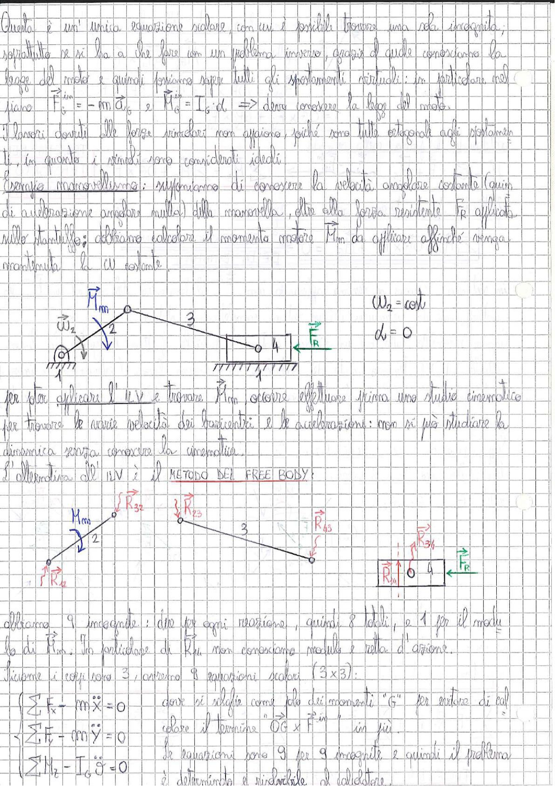

# Page 108 - Metodo del Free Body e Lavori Virtuali (Manovellismo)

Questa è un'unica equazione scalare, con cui è possibile trovare una sola incognita, soprattutto se si ha a che fare con un problema inverso, grazie al quale conosciamo la legge del moto e quindi possiamo sapere tutti gli spostamenti virtuali; in particolare nel piano:

$$\vec{F}_i = -m\vec{a}_G \quad e \quad \vec{M}_i = I_G \cdot \dot{\omega} \quad \Rightarrow \text{ devo conoscere la legge del moto.}$$

I lavori dovuti alle forze vincolari non appaiono, poiché sono tutte ortogonali agli spostamenti, in quanto i vincoli sono considerati ideali.

**(Esempio manovellismo):** supponiamo di conoscere la velocità angolare costante (quindi di accelerazione angolare nulla) della manovella, oltre alla forza resistente $\vec{F}_R$ applicata sullo stantuffo; dobbiamo calcolare il momento motore $\vec{M}_m$ da applicare affinché venga mantenuta la $\omega$ costante.

> 
> Diagramma: Schema cinematico di un manovellismo (quadrilatero articolato biella-manovella) con manovella (2), biella (3), stantuffo (4) su guida fissa (1). Indicati: momento motore $\vec{M}_m$ sulla manovella, velocità angolare $\vec{\omega}_2$, forza resistente $\vec{F}_R$ sullo stantuffo. Condizioni: $\omega_2 = \text{cost}$, $\dot{\omega} = 0$.

Per poter applicare il L.V. e trovare $\vec{M}_m$ occorre effettuare prima uno studio cinematico per trovare le varie velocità dei baricentri e le accelerazioni: non si può studiare la dinamica senza conoscere la cinematica.

L'alternativa al L.V. è il **METODO DEL FREE BODY**:

> 
> Diagramma: Scomposizione del manovellismo in corpi liberi (free body). Manovella (2) con momento $M_m$, reazione vincolare $\vec{R}_{12}$ e forza $\vec{R}_{32}$. Biella (3) con forze $\vec{R}_{23}$ e $\vec{R}_{43}$. Stantuffo (4) con reazione $\vec{R}_{14}$, forza $\vec{R}_{34}$ e forza resistente $\vec{F}_R$.

Abbiamo 9 incognite: due per ogni reazione, quindi 8 totali, e 1 per il modulo di $\vec{R}_{14}$. In particolare di $\vec{R}_{14}$ non conosciamo modulo e retta d'azione.

Siccome i corpi sono 3, avremo 9 equazioni scalari ($3 \times 3$):

$$\boxed{\begin{cases} \sum F_x - m\ddot{x} = 0 \\ \sum F_y - m\ddot{y} = 0 \\ \sum M_G - I_G \ddot{\vartheta} = 0 \end{cases}}$$

dove si sceglie come polo dei momenti "G" per evitare di calcolare il termine $\vec{OG} \times \vec{F}_i$ in più.

Le equazioni sono 9 per 9 incognite e quindi il problema è determinato e risolvibile al calcolatore.
