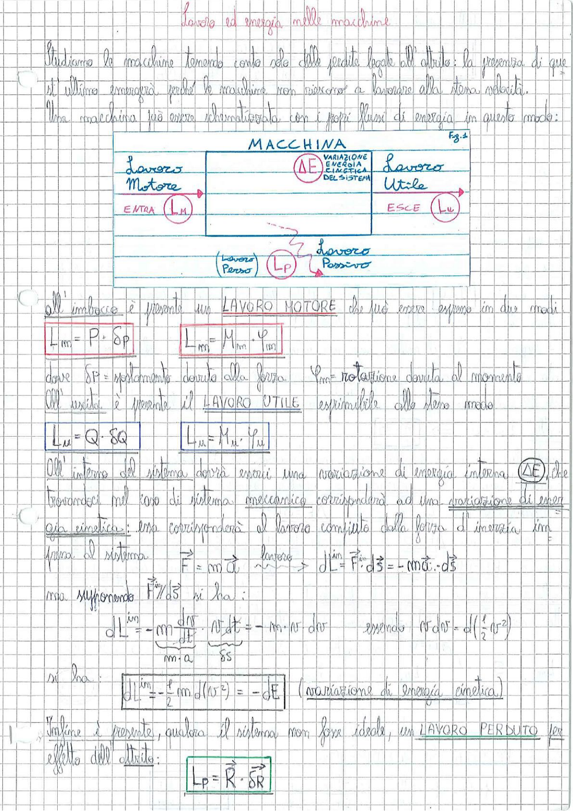

# Page 111 - Lavoro ed energia nelle macchine

Studiamo le macchine tenendo conto solo delle perdite legate all'attrito: la presenza di quest'ultimo emergerà perché le macchine non riescono a lavorare alla stessa velocità.

Una macchina può essere schematizzata con i propri flussi di energia in questo modo:

> 
> Diagramma: Schema a blocchi di una macchina con flussi energetici: Lavoro Motore ($L_M$) in ingresso (ENTRA), variazione di energia cinetica del sistema ($\Delta E$) al centro, Lavoro Utile ($L_u$) in uscita (ESCE), e Lavoro Passivo/Perso ($L_P$) verso il basso.

---

All'imbocco è presente un **LAVORO MOTORE** che può essere espresso in due modi:

$$\boxed{L_m = P \cdot \delta p} \qquad \boxed{L_m = M_m \cdot \varphi_m}$$

dove $\delta p$ = spostamento dovuto alla forza, $\varphi_m$ = rotazione dovuta al momento.

All'uscita è presente il **LAVORO UTILE** esprimibile allo stesso modo:

$$\boxed{L_u = Q \cdot \delta Q} \qquad \boxed{L_u = M_u \cdot \varphi_u}$$

All'interno del sistema dovrà esserci una variazione di energia interna ($\Delta E$), che trovandoci nel caso di sistema meccanico corrisponderà ad una variazione di energia cinetica: essa corrisponderà al lavoro compiuto dalla forza di inerzia impressa al sistema.

$$\vec{F} = m\vec{a} \quad \xrightarrow{\text{lavoro}} \quad dL^{in} = \vec{F^{in}} \cdot d\vec{s} = -m\vec{a} \cdot d\vec{s}$$

ma supponendo $\vec{F} \parallel d\vec{s}$ si ha:

$$dL^{in} = -m\frac{ds}{dt} \cdot \underbrace{v \, dt}_{m \cdot a} = -m \cdot v \cdot dv \qquad \text{essendo } v \, dv = d\left(\frac{1}{2}v^2\right)$$

si ha:

$$\boxed{dL^{in} = -\frac{1}{2}m \, d(v^2) = -dE} \quad \text{(variazione di energia cinetica)}$$

Infine è presente, qualora il sistema non fosse ideale, un **LAVORO PERDUTO** per effetto dell'attrito:

$$\boxed{L_P = \vec{R} \cdot \delta R}$$
