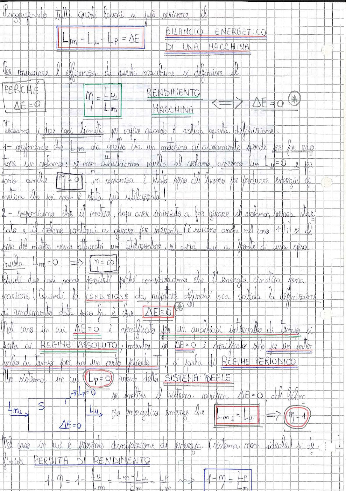

# Page 112 - Bilancio Energetico e Rendimento di una Macchina

Raggruppando tutti questi lavori si può scrivere il

## BILANCIO ENERGETICO DI UNA MACCHINA

$$\boxed{L_m - L_u - L_p = \Delta E}$$

Per misurare l'efficienza di queste macchine si definisce il

## RENDIMENTO MACCHINA

| PERCHÉ | | | |
|--------|--|--|--|
| $\Delta E = 0$ | $\boxed{\eta = \dfrac{L_u}{L_m}}$ | | $\iff \quad \Delta E = 0 \quad (*)$ |

Vediamo i due casi limite per capire quando è valida questa definizione:

**1–** Supponiamo che $L_m$ sia quello che un motorino di avviamento spende per far ruotare un volano: se non attacchiamo nulla al volano, avremo un $L_u = 0$ e per tanto anche $\boxed{\eta = 0}$. In sostanza è stato speso del lavoro per produrre energia cinetica che poi non è stata più utilizzata!

**2–** Supponiamo che il motore, dopo aver iniziato a far girare il volano, venga staccato e il volano continui a girare per inerzia (è successo anche nel caso 1–): se al posto del motore viene attaccato un utilizzatore, si avrà $L_u$ a fronte di una spesa nulla $L_m = 0 \implies \boxed{\eta = \infty}$.

Questi due casi sono possibili poiché consideriamo che l'energia cinetica possa variare! Quindi la **condizione da rispettare** affinché sia valida la definizione di rendimento data sopra è che:

$$\boxed{\Delta E = 0} \quad (*)$$

Nel caso in cui $\Delta E = 0$ è verificato per un qualsiasi intervallo di tempo si parla di **REGIME ASSOLUTO**; mentre se $\Delta E = 0$ è verificato solo per un intervallo di tempo pari ad un certo periodo $T$, si parla di **REGIME PERIODICO**.

---

Un sistema in cui $\boxed{L_p = 0}$ viene detto **SISTEMA IDEALE**.

Se inoltre il sistema verifica $\Delta E = 0$, dal bilancio energetico emerge che:

> 
> Diagramma: schema a blocchi con ingresso $L_m$, blocco $S$ con $\Delta E = 0$ e $L_p = 0$, e uscita $L_u$

$$\boxed{L_m = L_u} \implies \boxed{\eta = 1}$$

---

Nel caso in cui è presente dissipazione di energia (sistema non ideale) si definisce **PERDITA DI RENDIMENTO**:

$$1 - \eta = 1 - \frac{L_u}{L_m} = \frac{L_m - L_u}{L_m} = \frac{L_p}{L_m} \implies \boxed{1 - \eta = \frac{L_p}{L_m}}$$
