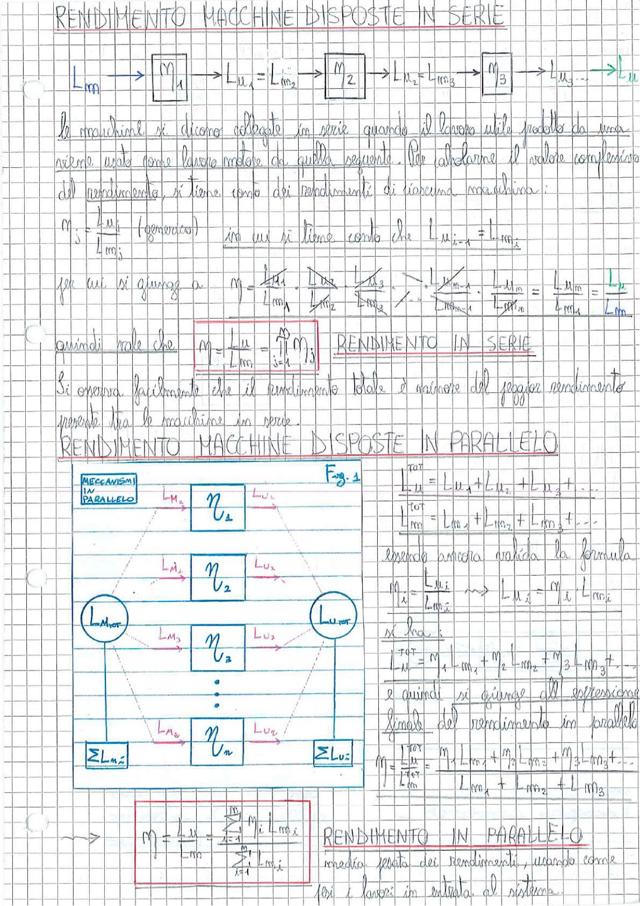

# Page 113 - Rendimento macchine disposte in serie e in parallelo

## Rendimento macchine disposte in serie

> 
> Diagramma: Schema a blocchi di macchine in serie, con lavoro motore $L_m$ in ingresso, passante attraverso macchine $\eta_1$, $\eta_2$, $\eta_3$... con lavori utili/motori intermedi, e lavoro utile $L_u$ in uscita.

Le macchine si dicono collegate in serie quando il lavoro utile prodotto da una viene usato come lavoro motore da quella seguente. Per calcolare il valore complessivo del rendimento, si tiene conto dei rendimenti di ciascuna macchina:

$$\eta_i = \frac{L_{u_i}}{L_{m_i}} \quad \text{(generico)}$$

in cui si tiene conto che $L_{u_{i-1}} = L_{m_i}$

per cui si giunge a:

$$\eta = \frac{L_{u_1}}{L_{m_A}} \cdot \frac{L_{u_2}}{L_{m_2}} \cdot \frac{L_{u_3}}{L_{m_3}} \cdot \ldots \cdot \frac{L_{u_{m-1}}}{L_{m_{m-1}}} \cdot \frac{L_{u_m}}{L_{m_m}} = \frac{L_u}{L_m}$$

quindi vale che:

$$\boxed{\eta = \frac{L_u}{L_m} = \prod_{i=1}^{n} \eta_i}$$
**RENDIMENTO IN SERIE**

Si osserva facilmente che il rendimento totale è minore del peggior rendimento presente tra le macchine in serie.

---

## Rendimento macchine disposte in parallelo

> 
> Diagramma: Schema a blocchi di meccanismi in parallelo ($\eta_1, \eta_2, \eta_3, \ldots, \eta_n$), ciascuno con il proprio lavoro motore $L_{M_i}$ in ingresso e lavoro utile $L_{U_i}$ in uscita. Il lavoro motore totale $L_{M_{TOT}}$ si ripartisce tra le macchine, e i lavori utili si sommano in $L_{U_{TOT}}$.

$$L_u^{TOT} = L_{u_1} + L_{u_2} + L_{u_3} + \ldots$$

$$L_m^{TOT} = L_{m_1} + L_{m_2} + L_{m_3} + \ldots$$

Essendo ancora valida la formula:

$$\eta_i = \frac{L_{u_i}}{L_{m_i}} \implies L_{u_i} = \eta_i \cdot L_{m_i}$$

si ha:

$$L_u^{TOT} = \eta_1 \cdot L_{m_1} + \eta_2 \cdot L_{m_2} + \eta_3 \cdot L_{m_3} + \ldots$$

e quindi si giunge all'espressione finale del rendimento in parallelo:

$$\eta = \frac{L_u^{TOT}}{L_m^{TOT}} = \frac{\eta_1 \cdot L_{m_1} + \eta_2 \cdot L_{m_2} + \eta_3 \cdot L_{m_3} + \ldots}{L_{m_1} + L_{m_2} + L_{m_3}}$$

$$\boxed{\eta = \frac{L_u}{L_m} = \frac{\displaystyle\sum_{i=1}^{n} \eta_i \cdot L_{m_i}}{\displaystyle\sum_{i=1}^{n} L_{m_i}}}$$
**RENDIMENTO IN PARALLELO**

Media pesata dei rendimenti, usando come pesi i lavori in entrata al sistema.
